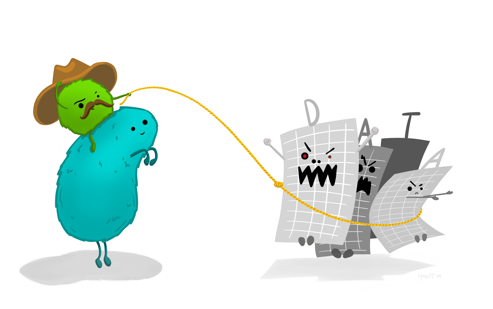
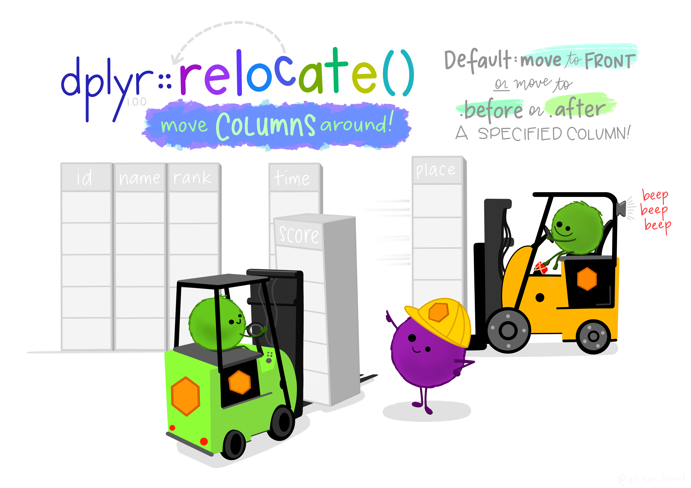
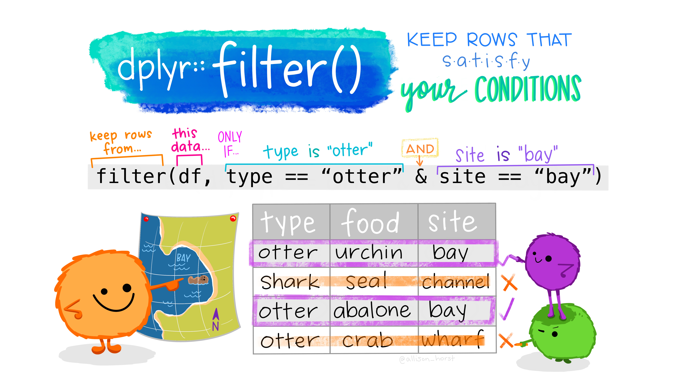
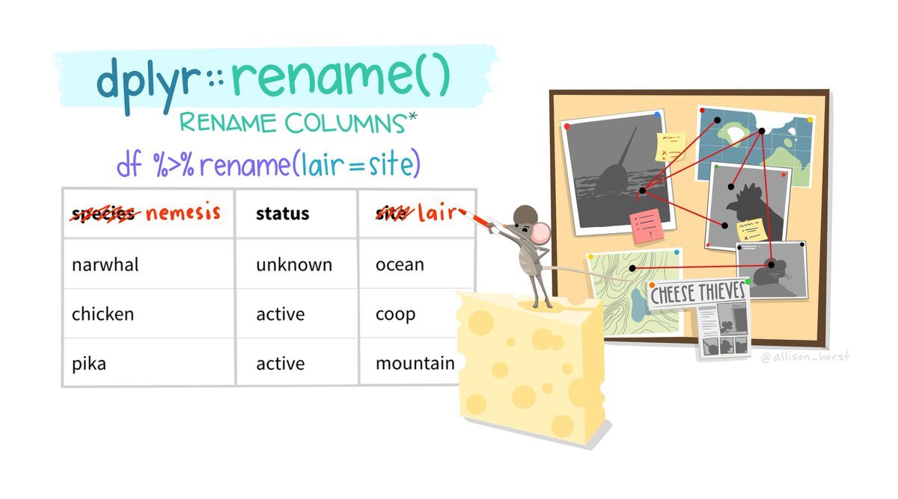
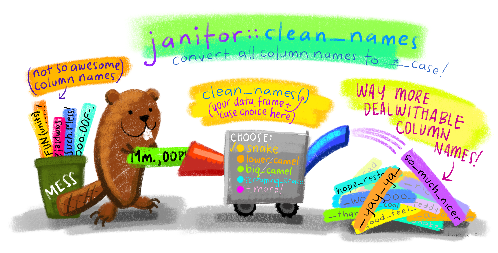
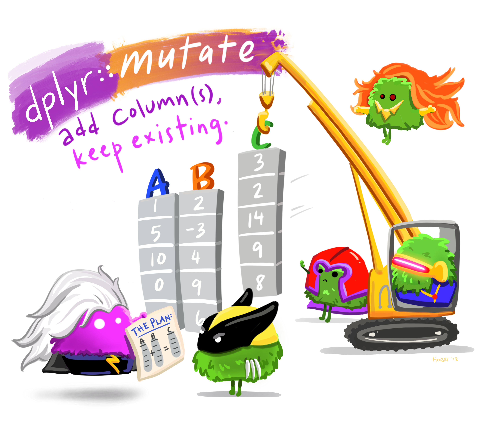

# Basic Wrangling


{width=100%}
<p style="font-size:6pt">Artwork by @allison_horst</p>

::: {.rmdimportant}
**Throughout this page, explanations for the code above will appear in blocks like this one!**
:::

When wrangling your data, you will be performing a series of actions to clean and prepare it for whatever task you have. Whether you are creating visualizations, performing statistical analyses, or doing anything else, you will likely need to change your data object in some way. Below, several of the most fundamental and basic data manipulation functions will be outlined. You will notice that the function names are all verbs, denoting that they are performing some action on the data object.

You may find it helpful to review the [section](#pipes) on pipes before moving forward!

## Locating

### Indexing

Indexing dfs was introduced [previously](#Indexing-dfs), but will often need to be done throughout a pipe chain. There are two functions to help with this: `pull()` and `pluck()`.

#### pull()

`pull()` will extract a variable from a df. This can be done by the variable's name or its numeric position (using name is always preferred). `pull()` is like using the `$` operator to index.


``` r
mtcars2 %>%
  pull(cyl)
#> [1] 4 4 4 8 6 8 4
```

The result is a vector, as variables are just vectors! This is helpful because it allows the result to then be piped to a number of functions that require a vector rather than a df. For example:


``` r
mtcars2 %>% 
  select(cyl) %>% 
  mean()
#> Warning in mean.default(.): argument is not numeric or
#> logical: returning NA
#> [1] NA
mtcars2 %>%
  pull(cyl) %>%
  mean()
#> [1] 5.428571
```

By using `select()`, the result is a dataframe with one column. When trying to pass this to `mean()`, you get an `NA` and an error:

<p style="color:#A79BF0"> **Warning message: In mean.default(.) : argument is not numeric or logical: returning NA.**</p>

By using `pull()`, the result is a vector and can be passed to `mean()` without issue.

#### pluck()

`pluck()` allows you to index elements from an object, and can also be done by name or numeric position. Above, the `cyl` column was indexed from `mtcars2`. Say you wanted the 4th observation from that column:


``` r
mtcars2 %>%
  pull(cyl) %>%
  pluck(4)
#> [1] 8
```

<button class="btn btn-primary" data-toggle="collapse" data-target="#BlockName"> Advanced </button>  
<div id="BlockName" class="collapse">  

`pluck()` is extremely useful for indexing deeply into nested data structures. These will not be covered in this course, but as a brief demonstration you can consider a df to be a nested object. Each vector is an 1st level element and then values within vectors are 2nd level elements. To get the 4th value in the 3rd vector (the previous code string), you would do the following:


``` r
mtcars2 %>%
  pluck(3,4)
#> [1] 8
```

This can also be done with named positions.


``` r
mtcars2 %>%
  pluck("model", 2)
#> [1] "Porsche 914-2"
```

In short, each argument in `pluck()` is a position to index. `x %>% pluck(2, 2)` == `x[[2]][[2]]`

### Unique Entries {#Unique-Entries}

When working with larger dfs, it is difficult to get a sense of the unique values a particular variable may contain. You can get this using `distinct()`.


``` r
mtcars2
#>            model mpg cyl disp  hp   wt gear
#> 1      Fiat X1-9  27   4   79  66 1.94    4
#> 2  Porsche 914-2  26   4  120  91 2.14    5
#> 3   Lotus Europa  30   4   95 113 1.51    5
#> 4 Ford Pantera L  16   8  351 264 3.17    5
#> 5   Ferrari Dino  20   6  145 175 2.77    5
#> 6  Maserati Bora  15   8  301 335 3.57    5
#> 7     Volvo 142E  21   4  121 109 2.78    4
mtcars2 %>%
  distinct(cyl)
#>   cyl
#> 1   4
#> 2   8
#> 3   6
```

The way this works is by keeping the row that corresponds with the first entry of a unique value from that particular column. This becomes clear by using the `.keep_all` argument


``` r
mtcars2 %>%
  distinct(cyl, .keep_all = TRUE)
#>            model mpg cyl disp  hp   wt gear
#> 1      Fiat X1-9  27   4   79  66 1.94    4
#> 2 Ford Pantera L  16   8  351 264 3.17    5
#> 3   Ferrari Dino  20   6  145 175 2.77    5
```

To get the *number* of unique values you can use `n_distinct()`, which takes a vector of values as input.


``` r
mtcars2 %>%
  pull(cyl) %>%
  n_distinct()
#> [1] 3
```

</div>

## Re-Locating

Sometimes, you can find the values you want, but you want to change where they are in the dataframe. We'll look at how to do this, first for columns, then for rows.

### Relocate

`relocate()` can be used to reorder the columns in your dataframe. With `relocate()`, you specify which column(s) you want to move, and what they should come *.before* or *.after*.

{width=100%}
<p style="font-size:6pt">Artwork by @allison_horst</p>


``` r
mtcars2 %>%
  relocate(wt, .after = model)
```


<table class="kable_wrapper">
<tbody>
  <tr>
   <td> 

<table class=" lightable-paper table table-striped table-hover table-condensed table-responsive" style='font-family: "Arial Narrow", arial, helvetica, sans-serif; width: auto !important; margin-left: auto; margin-right: auto; margin-left: auto; margin-right: auto;'>
 <thead>
  <tr>
   <th style="text-align:left;font-weight: bold;text-decoration: underline;color: white !important;text-align: center;"> model </th>
   <th style="text-align:right;font-weight: bold;text-decoration: underline;color: white !important;text-align: center;"> mpg </th>
   <th style="text-align:right;font-weight: bold;text-decoration: underline;color: white !important;text-align: center;"> cyl </th>
   <th style="text-align:right;font-weight: bold;text-decoration: underline;color: white !important;text-align: center;"> disp </th>
   <th style="text-align:right;font-weight: bold;text-decoration: underline;color: white !important;text-align: center;"> hp </th>
   <th style="text-align:right;font-weight: bold;text-decoration: underline;color: white !important;text-align: center;"> wt </th>
   <th style="text-align:right;font-weight: bold;text-decoration: underline;color: white !important;text-align: center;"> gear </th>
  </tr>
 </thead>
<tbody>
  <tr>
   <td style="text-align:left;color: white !important;"> Fiat X1-9 </td>
   <td style="text-align:right;color: white !important;"> 27 </td>
   <td style="text-align:right;color: white !important;"> 4 </td>
   <td style="text-align:right;color: white !important;"> 79 </td>
   <td style="text-align:right;color: white !important;"> 66 </td>
   <td style="text-align:right;color: white !important;color: white !important;background-color: lightgreen !important;"> 1.94 </td>
   <td style="text-align:right;color: white !important;"> 4 </td>
  </tr>
  <tr>
   <td style="text-align:left;color: white !important;"> Porsche 914-2 </td>
   <td style="text-align:right;color: white !important;"> 26 </td>
   <td style="text-align:right;color: white !important;"> 4 </td>
   <td style="text-align:right;color: white !important;"> 120 </td>
   <td style="text-align:right;color: white !important;"> 91 </td>
   <td style="text-align:right;color: white !important;color: white !important;background-color: lightgreen !important;"> 2.14 </td>
   <td style="text-align:right;color: white !important;"> 5 </td>
  </tr>
  <tr>
   <td style="text-align:left;color: white !important;"> Lotus Europa </td>
   <td style="text-align:right;color: white !important;"> 30 </td>
   <td style="text-align:right;color: white !important;"> 4 </td>
   <td style="text-align:right;color: white !important;"> 95 </td>
   <td style="text-align:right;color: white !important;"> 113 </td>
   <td style="text-align:right;color: white !important;color: white !important;background-color: lightgreen !important;"> 1.51 </td>
   <td style="text-align:right;color: white !important;"> 5 </td>
  </tr>
  <tr>
   <td style="text-align:left;color: white !important;"> Ford Pantera L </td>
   <td style="text-align:right;color: white !important;"> 16 </td>
   <td style="text-align:right;color: white !important;"> 8 </td>
   <td style="text-align:right;color: white !important;"> 351 </td>
   <td style="text-align:right;color: white !important;"> 264 </td>
   <td style="text-align:right;color: white !important;color: white !important;background-color: lightgreen !important;"> 3.17 </td>
   <td style="text-align:right;color: white !important;"> 5 </td>
  </tr>
  <tr>
   <td style="text-align:left;color: white !important;"> Ferrari Dino </td>
   <td style="text-align:right;color: white !important;"> 20 </td>
   <td style="text-align:right;color: white !important;"> 6 </td>
   <td style="text-align:right;color: white !important;"> 145 </td>
   <td style="text-align:right;color: white !important;"> 175 </td>
   <td style="text-align:right;color: white !important;color: white !important;background-color: lightgreen !important;"> 2.77 </td>
   <td style="text-align:right;color: white !important;"> 5 </td>
  </tr>
  <tr>
   <td style="text-align:left;color: white !important;"> Maserati Bora </td>
   <td style="text-align:right;color: white !important;"> 15 </td>
   <td style="text-align:right;color: white !important;"> 8 </td>
   <td style="text-align:right;color: white !important;"> 301 </td>
   <td style="text-align:right;color: white !important;"> 335 </td>
   <td style="text-align:right;color: white !important;color: white !important;background-color: lightgreen !important;"> 3.57 </td>
   <td style="text-align:right;color: white !important;"> 5 </td>
  </tr>
  <tr>
   <td style="text-align:left;color: white !important;"> Volvo 142E </td>
   <td style="text-align:right;color: white !important;"> 21 </td>
   <td style="text-align:right;color: white !important;"> 4 </td>
   <td style="text-align:right;color: white !important;"> 121 </td>
   <td style="text-align:right;color: white !important;"> 109 </td>
   <td style="text-align:right;color: white !important;color: white !important;background-color: lightgreen !important;"> 2.78 </td>
   <td style="text-align:right;color: white !important;"> 4 </td>
  </tr>
</tbody>
</table>

 </td>
   <td> 

<table class=" lightable-paper" style='font-family: "Arial Narrow", arial, helvetica, sans-serif; width: auto !important; margin-left: auto; margin-right: auto;'>
 <thead>
  <tr>
   <th style="text-align:left;font-size: 0px;"> test </th>
  </tr>
 </thead>
<tbody>
  <tr>
   <td style="text-align:left;">  
</td>
  </tr>
  <tr>
   <td style="text-align:left;">  
</td>
  </tr>
  <tr>
   <td style="text-align:left;">  
</td>
  </tr>
  <tr>
   <td style="text-align:left;">  
</td>
  </tr>
</tbody>
</table>

 </td>
   <td> 

<table class=" lightable-paper table table-striped table-hover table-condensed table-responsive" style='font-family: "Arial Narrow", arial, helvetica, sans-serif; width: auto !important; margin-left: auto; margin-right: auto; margin-left: auto; margin-right: auto;'>
 <thead>
  <tr>
   <th style="text-align:left;font-weight: bold;text-decoration: underline;color: white !important;text-align: center;"> model </th>
   <th style="text-align:right;font-weight: bold;text-decoration: underline;color: white !important;text-align: center;"> wt </th>
   <th style="text-align:right;font-weight: bold;text-decoration: underline;color: white !important;text-align: center;"> mpg </th>
   <th style="text-align:right;font-weight: bold;text-decoration: underline;color: white !important;text-align: center;"> cyl </th>
   <th style="text-align:right;font-weight: bold;text-decoration: underline;color: white !important;text-align: center;"> disp </th>
   <th style="text-align:right;font-weight: bold;text-decoration: underline;color: white !important;text-align: center;"> hp </th>
   <th style="text-align:right;font-weight: bold;text-decoration: underline;color: white !important;text-align: center;"> gear </th>
  </tr>
 </thead>
<tbody>
  <tr>
   <td style="text-align:left;color: white !important;"> Fiat X1-9 </td>
   <td style="text-align:right;color: white !important;color: white !important;background-color: lightgreen !important;"> 1.94 </td>
   <td style="text-align:right;color: white !important;"> 27 </td>
   <td style="text-align:right;color: white !important;"> 4 </td>
   <td style="text-align:right;color: white !important;"> 79 </td>
   <td style="text-align:right;color: white !important;"> 66 </td>
   <td style="text-align:right;color: white !important;"> 4 </td>
  </tr>
  <tr>
   <td style="text-align:left;color: white !important;"> Porsche 914-2 </td>
   <td style="text-align:right;color: white !important;color: white !important;background-color: lightgreen !important;"> 2.14 </td>
   <td style="text-align:right;color: white !important;"> 26 </td>
   <td style="text-align:right;color: white !important;"> 4 </td>
   <td style="text-align:right;color: white !important;"> 120 </td>
   <td style="text-align:right;color: white !important;"> 91 </td>
   <td style="text-align:right;color: white !important;"> 5 </td>
  </tr>
  <tr>
   <td style="text-align:left;color: white !important;"> Lotus Europa </td>
   <td style="text-align:right;color: white !important;color: white !important;background-color: lightgreen !important;"> 1.51 </td>
   <td style="text-align:right;color: white !important;"> 30 </td>
   <td style="text-align:right;color: white !important;"> 4 </td>
   <td style="text-align:right;color: white !important;"> 95 </td>
   <td style="text-align:right;color: white !important;"> 113 </td>
   <td style="text-align:right;color: white !important;"> 5 </td>
  </tr>
  <tr>
   <td style="text-align:left;color: white !important;"> Ford Pantera L </td>
   <td style="text-align:right;color: white !important;color: white !important;background-color: lightgreen !important;"> 3.17 </td>
   <td style="text-align:right;color: white !important;"> 16 </td>
   <td style="text-align:right;color: white !important;"> 8 </td>
   <td style="text-align:right;color: white !important;"> 351 </td>
   <td style="text-align:right;color: white !important;"> 264 </td>
   <td style="text-align:right;color: white !important;"> 5 </td>
  </tr>
  <tr>
   <td style="text-align:left;color: white !important;"> Ferrari Dino </td>
   <td style="text-align:right;color: white !important;color: white !important;background-color: lightgreen !important;"> 2.77 </td>
   <td style="text-align:right;color: white !important;"> 20 </td>
   <td style="text-align:right;color: white !important;"> 6 </td>
   <td style="text-align:right;color: white !important;"> 145 </td>
   <td style="text-align:right;color: white !important;"> 175 </td>
   <td style="text-align:right;color: white !important;"> 5 </td>
  </tr>
  <tr>
   <td style="text-align:left;color: white !important;"> Maserati Bora </td>
   <td style="text-align:right;color: white !important;color: white !important;background-color: lightgreen !important;"> 3.57 </td>
   <td style="text-align:right;color: white !important;"> 15 </td>
   <td style="text-align:right;color: white !important;"> 8 </td>
   <td style="text-align:right;color: white !important;"> 301 </td>
   <td style="text-align:right;color: white !important;"> 335 </td>
   <td style="text-align:right;color: white !important;"> 5 </td>
  </tr>
  <tr>
   <td style="text-align:left;color: white !important;"> Volvo 142E </td>
   <td style="text-align:right;color: white !important;color: white !important;background-color: lightgreen !important;"> 2.78 </td>
   <td style="text-align:right;color: white !important;"> 21 </td>
   <td style="text-align:right;color: white !important;"> 4 </td>
   <td style="text-align:right;color: white !important;"> 121 </td>
   <td style="text-align:right;color: white !important;"> 109 </td>
   <td style="text-align:right;color: white !important;"> 4 </td>
  </tr>
</tbody>
</table>

 </td>
  </tr>
</tbody>
</table>


::: {.rmdimportant}
**This code moves the `wt` column *after* the `model` column.**
:::

`relocate()` can also move multiple columns simultaneously when passed a vector of column names.


``` r
mtcars2 %>%
  relocate(c(disp, drat), .after = model)
```


<table class="kable_wrapper">
<tbody>
  <tr>
   <td> 

<table class=" lightable-paper table table-striped table-hover table-condensed table-responsive" style='font-family: "Arial Narrow", arial, helvetica, sans-serif; width: auto !important; margin-left: auto; margin-right: auto; margin-left: auto; margin-right: auto;'>
 <thead>
  <tr>
   <th style="text-align:left;font-weight: bold;text-decoration: underline;color: white !important;text-align: center;"> model </th>
   <th style="text-align:right;font-weight: bold;text-decoration: underline;color: white !important;text-align: center;"> mpg </th>
   <th style="text-align:right;font-weight: bold;text-decoration: underline;color: white !important;text-align: center;"> cyl </th>
   <th style="text-align:right;font-weight: bold;text-decoration: underline;color: white !important;text-align: center;"> disp </th>
   <th style="text-align:right;font-weight: bold;text-decoration: underline;color: white !important;text-align: center;"> hp </th>
   <th style="text-align:right;font-weight: bold;text-decoration: underline;color: white !important;text-align: center;"> wt </th>
   <th style="text-align:right;font-weight: bold;text-decoration: underline;color: white !important;text-align: center;"> gear </th>
  </tr>
 </thead>
<tbody>
  <tr>
   <td style="text-align:left;color: white !important;"> Fiat X1-9 </td>
   <td style="text-align:right;color: white !important;"> 27 </td>
   <td style="text-align:right;color: white !important;"> 4 </td>
   <td style="text-align:right;color: white !important;color: white !important;background-color: lightgreen !important;"> 79 </td>
   <td style="text-align:right;color: white !important;"> 66 </td>
   <td style="text-align:right;color: white !important;color: white !important;background-color: lightgreen !important;"> 1.94 </td>
   <td style="text-align:right;color: white !important;"> 4 </td>
  </tr>
  <tr>
   <td style="text-align:left;color: white !important;"> Porsche 914-2 </td>
   <td style="text-align:right;color: white !important;"> 26 </td>
   <td style="text-align:right;color: white !important;"> 4 </td>
   <td style="text-align:right;color: white !important;color: white !important;background-color: lightgreen !important;"> 120 </td>
   <td style="text-align:right;color: white !important;"> 91 </td>
   <td style="text-align:right;color: white !important;color: white !important;background-color: lightgreen !important;"> 2.14 </td>
   <td style="text-align:right;color: white !important;"> 5 </td>
  </tr>
  <tr>
   <td style="text-align:left;color: white !important;"> Lotus Europa </td>
   <td style="text-align:right;color: white !important;"> 30 </td>
   <td style="text-align:right;color: white !important;"> 4 </td>
   <td style="text-align:right;color: white !important;color: white !important;background-color: lightgreen !important;"> 95 </td>
   <td style="text-align:right;color: white !important;"> 113 </td>
   <td style="text-align:right;color: white !important;color: white !important;background-color: lightgreen !important;"> 1.51 </td>
   <td style="text-align:right;color: white !important;"> 5 </td>
  </tr>
  <tr>
   <td style="text-align:left;color: white !important;"> Ford Pantera L </td>
   <td style="text-align:right;color: white !important;"> 16 </td>
   <td style="text-align:right;color: white !important;"> 8 </td>
   <td style="text-align:right;color: white !important;color: white !important;background-color: lightgreen !important;"> 351 </td>
   <td style="text-align:right;color: white !important;"> 264 </td>
   <td style="text-align:right;color: white !important;color: white !important;background-color: lightgreen !important;"> 3.17 </td>
   <td style="text-align:right;color: white !important;"> 5 </td>
  </tr>
  <tr>
   <td style="text-align:left;color: white !important;"> Ferrari Dino </td>
   <td style="text-align:right;color: white !important;"> 20 </td>
   <td style="text-align:right;color: white !important;"> 6 </td>
   <td style="text-align:right;color: white !important;color: white !important;background-color: lightgreen !important;"> 145 </td>
   <td style="text-align:right;color: white !important;"> 175 </td>
   <td style="text-align:right;color: white !important;color: white !important;background-color: lightgreen !important;"> 2.77 </td>
   <td style="text-align:right;color: white !important;"> 5 </td>
  </tr>
  <tr>
   <td style="text-align:left;color: white !important;"> Maserati Bora </td>
   <td style="text-align:right;color: white !important;"> 15 </td>
   <td style="text-align:right;color: white !important;"> 8 </td>
   <td style="text-align:right;color: white !important;color: white !important;background-color: lightgreen !important;"> 301 </td>
   <td style="text-align:right;color: white !important;"> 335 </td>
   <td style="text-align:right;color: white !important;color: white !important;background-color: lightgreen !important;"> 3.57 </td>
   <td style="text-align:right;color: white !important;"> 5 </td>
  </tr>
  <tr>
   <td style="text-align:left;color: white !important;"> Volvo 142E </td>
   <td style="text-align:right;color: white !important;"> 21 </td>
   <td style="text-align:right;color: white !important;"> 4 </td>
   <td style="text-align:right;color: white !important;color: white !important;background-color: lightgreen !important;"> 121 </td>
   <td style="text-align:right;color: white !important;"> 109 </td>
   <td style="text-align:right;color: white !important;color: white !important;background-color: lightgreen !important;"> 2.78 </td>
   <td style="text-align:right;color: white !important;"> 4 </td>
  </tr>
</tbody>
</table>

 </td>
   <td> 

<table class=" lightable-paper" style='font-family: "Arial Narrow", arial, helvetica, sans-serif; width: auto !important; margin-left: auto; margin-right: auto;'>
 <thead>
  <tr>
   <th style="text-align:left;font-size: 0px;"> test </th>
  </tr>
 </thead>
<tbody>
  <tr>
   <td style="text-align:left;">  
</td>
  </tr>
  <tr>
   <td style="text-align:left;">  
</td>
  </tr>
  <tr>
   <td style="text-align:left;">  
</td>
  </tr>
  <tr>
   <td style="text-align:left;">  
</td>
  </tr>
</tbody>
</table>

 </td>
   <td> 

<table class=" lightable-paper table table-striped table-hover table-condensed table-responsive" style='font-family: "Arial Narrow", arial, helvetica, sans-serif; width: auto !important; margin-left: auto; margin-right: auto; margin-left: auto; margin-right: auto;'>
 <thead>
  <tr>
   <th style="text-align:left;font-weight: bold;text-decoration: underline;color: white !important;text-align: center;"> model </th>
   <th style="text-align:right;font-weight: bold;text-decoration: underline;color: white !important;text-align: center;"> disp </th>
   <th style="text-align:right;font-weight: bold;text-decoration: underline;color: white !important;text-align: center;"> wt </th>
   <th style="text-align:right;font-weight: bold;text-decoration: underline;color: white !important;text-align: center;"> mpg </th>
   <th style="text-align:right;font-weight: bold;text-decoration: underline;color: white !important;text-align: center;"> cyl </th>
   <th style="text-align:right;font-weight: bold;text-decoration: underline;color: white !important;text-align: center;"> hp </th>
   <th style="text-align:right;font-weight: bold;text-decoration: underline;color: white !important;text-align: center;"> gear </th>
  </tr>
 </thead>
<tbody>
  <tr>
   <td style="text-align:left;color: white !important;"> Fiat X1-9 </td>
   <td style="text-align:right;color: white !important;color: white !important;background-color: lightgreen !important;"> 79 </td>
   <td style="text-align:right;color: white !important;color: white !important;background-color: lightgreen !important;"> 1.94 </td>
   <td style="text-align:right;color: white !important;"> 27 </td>
   <td style="text-align:right;color: white !important;"> 4 </td>
   <td style="text-align:right;color: white !important;"> 66 </td>
   <td style="text-align:right;color: white !important;"> 4 </td>
  </tr>
  <tr>
   <td style="text-align:left;color: white !important;"> Porsche 914-2 </td>
   <td style="text-align:right;color: white !important;color: white !important;background-color: lightgreen !important;"> 120 </td>
   <td style="text-align:right;color: white !important;color: white !important;background-color: lightgreen !important;"> 2.14 </td>
   <td style="text-align:right;color: white !important;"> 26 </td>
   <td style="text-align:right;color: white !important;"> 4 </td>
   <td style="text-align:right;color: white !important;"> 91 </td>
   <td style="text-align:right;color: white !important;"> 5 </td>
  </tr>
  <tr>
   <td style="text-align:left;color: white !important;"> Lotus Europa </td>
   <td style="text-align:right;color: white !important;color: white !important;background-color: lightgreen !important;"> 95 </td>
   <td style="text-align:right;color: white !important;color: white !important;background-color: lightgreen !important;"> 1.51 </td>
   <td style="text-align:right;color: white !important;"> 30 </td>
   <td style="text-align:right;color: white !important;"> 4 </td>
   <td style="text-align:right;color: white !important;"> 113 </td>
   <td style="text-align:right;color: white !important;"> 5 </td>
  </tr>
  <tr>
   <td style="text-align:left;color: white !important;"> Ford Pantera L </td>
   <td style="text-align:right;color: white !important;color: white !important;background-color: lightgreen !important;"> 351 </td>
   <td style="text-align:right;color: white !important;color: white !important;background-color: lightgreen !important;"> 3.17 </td>
   <td style="text-align:right;color: white !important;"> 16 </td>
   <td style="text-align:right;color: white !important;"> 8 </td>
   <td style="text-align:right;color: white !important;"> 264 </td>
   <td style="text-align:right;color: white !important;"> 5 </td>
  </tr>
  <tr>
   <td style="text-align:left;color: white !important;"> Ferrari Dino </td>
   <td style="text-align:right;color: white !important;color: white !important;background-color: lightgreen !important;"> 145 </td>
   <td style="text-align:right;color: white !important;color: white !important;background-color: lightgreen !important;"> 2.77 </td>
   <td style="text-align:right;color: white !important;"> 20 </td>
   <td style="text-align:right;color: white !important;"> 6 </td>
   <td style="text-align:right;color: white !important;"> 175 </td>
   <td style="text-align:right;color: white !important;"> 5 </td>
  </tr>
  <tr>
   <td style="text-align:left;color: white !important;"> Maserati Bora </td>
   <td style="text-align:right;color: white !important;color: white !important;background-color: lightgreen !important;"> 301 </td>
   <td style="text-align:right;color: white !important;color: white !important;background-color: lightgreen !important;"> 3.57 </td>
   <td style="text-align:right;color: white !important;"> 15 </td>
   <td style="text-align:right;color: white !important;"> 8 </td>
   <td style="text-align:right;color: white !important;"> 335 </td>
   <td style="text-align:right;color: white !important;"> 5 </td>
  </tr>
  <tr>
   <td style="text-align:left;color: white !important;"> Volvo 142E </td>
   <td style="text-align:right;color: white !important;color: white !important;background-color: lightgreen !important;"> 121 </td>
   <td style="text-align:right;color: white !important;color: white !important;background-color: lightgreen !important;"> 2.78 </td>
   <td style="text-align:right;color: white !important;"> 21 </td>
   <td style="text-align:right;color: white !important;"> 4 </td>
   <td style="text-align:right;color: white !important;"> 109 </td>
   <td style="text-align:right;color: white !important;"> 4 </td>
  </tr>
</tbody>
</table>

 </td>
  </tr>
</tbody>
</table>


### Arrange

`arrange()` orders the rows of a data frame by the values of selected columns. By default this will be ascending, where the lowest values are in the first few rows.


``` r
mtcars2 %>%
  arrange(wt)
```


<table class="kable_wrapper">
<tbody>
  <tr>
   <td> 

<table class=" lightable-paper table table-striped table-hover table-condensed table-responsive" style='font-family: "Arial Narrow", arial, helvetica, sans-serif; width: auto !important; margin-left: auto; margin-right: auto; margin-left: auto; margin-right: auto;'>
 <thead>
  <tr>
   <th style="text-align:left;font-weight: bold;text-decoration: underline;color: white !important;text-align: center;"> model </th>
   <th style="text-align:right;font-weight: bold;text-decoration: underline;color: white !important;text-align: center;"> mpg </th>
   <th style="text-align:right;font-weight: bold;text-decoration: underline;color: white !important;text-align: center;"> cyl </th>
   <th style="text-align:right;font-weight: bold;text-decoration: underline;color: white !important;text-align: center;"> disp </th>
   <th style="text-align:right;font-weight: bold;text-decoration: underline;color: white !important;text-align: center;"> hp </th>
   <th style="text-align:right;font-weight: bold;text-decoration: underline;color: white !important;text-align: center;"> wt </th>
   <th style="text-align:right;font-weight: bold;text-decoration: underline;color: white !important;text-align: center;"> gear </th>
   
   
  </tr>
 </thead>
<tbody>
  <tr>
   <td style="text-align:left;color: white !important;"> Fiat X1-9 </td>
   <td style="text-align:right;color: white !important;"> 27 </td>
   <td style="text-align:right;color: white !important;"> 4 </td>
   <td style="text-align:right;color: white !important;"> 79 </td>
   <td style="text-align:right;color: white !important;"> 66 </td>
   <td style="text-align:right;color: white !important;color: white !important;background-color: rgba(252, 187, 161, 1) !important;"> 1.94 </td>
   <td style="text-align:right;color: white !important;"> 4 </td>
   
   
  </tr>
  <tr>
   <td style="text-align:left;color: white !important;"> Porsche 914-2 </td>
   <td style="text-align:right;color: white !important;"> 26 </td>
   <td style="text-align:right;color: white !important;"> 4 </td>
   <td style="text-align:right;color: white !important;"> 120 </td>
   <td style="text-align:right;color: white !important;"> 91 </td>
   <td style="text-align:right;color: white !important;color: white !important;background-color: rgba(252, 146, 114, 1) !important;"> 2.14 </td>
   <td style="text-align:right;color: white !important;"> 5 </td>
   
   
  </tr>
  <tr>
   <td style="text-align:left;color: white !important;"> Lotus Europa </td>
   <td style="text-align:right;color: white !important;"> 30 </td>
   <td style="text-align:right;color: white !important;"> 4 </td>
   <td style="text-align:right;color: white !important;"> 95 </td>
   <td style="text-align:right;color: white !important;"> 113 </td>
   <td style="text-align:right;color: white !important;color: white !important;background-color: rgba(254, 229, 217, 1) !important;"> 1.51 </td>
   <td style="text-align:right;color: white !important;"> 5 </td>
   
   
  </tr>
  <tr>
   <td style="text-align:left;color: white !important;"> Ford Pantera L </td>
   <td style="text-align:right;color: white !important;"> 16 </td>
   <td style="text-align:right;color: white !important;"> 8 </td>
   <td style="text-align:right;color: white !important;"> 351 </td>
   <td style="text-align:right;color: white !important;"> 264 </td>
   <td style="text-align:right;color: white !important;color: white !important;background-color: rgba(203, 24, 29, 1) !important;"> 3.17 </td>
   <td style="text-align:right;color: white !important;"> 5 </td>
   
   
  </tr>
  <tr>
   <td style="text-align:left;color: white !important;"> Ferrari Dino </td>
   <td style="text-align:right;color: white !important;"> 20 </td>
   <td style="text-align:right;color: white !important;"> 6 </td>
   <td style="text-align:right;color: white !important;"> 145 </td>
   <td style="text-align:right;color: white !important;"> 175 </td>
   <td style="text-align:right;color: white !important;color: white !important;background-color: rgba(251, 106, 74, 1) !important;"> 2.77 </td>
   <td style="text-align:right;color: white !important;"> 5 </td>
   
   
  </tr>
  <tr>
   <td style="text-align:left;color: white !important;"> Maserati Bora </td>
   <td style="text-align:right;color: white !important;"> 15 </td>
   <td style="text-align:right;color: white !important;"> 8 </td>
   <td style="text-align:right;color: white !important;"> 301 </td>
   <td style="text-align:right;color: white !important;"> 335 </td>
   <td style="text-align:right;color: white !important;color: white !important;background-color: rgba(153, 0, 13, 1) !important;"> 3.57 </td>
   <td style="text-align:right;color: white !important;"> 5 </td>
   
   
  </tr>
  <tr>
   <td style="text-align:left;color: white !important;"> Volvo 142E </td>
   <td style="text-align:right;color: white !important;"> 21 </td>
   <td style="text-align:right;color: white !important;"> 4 </td>
   <td style="text-align:right;color: white !important;"> 121 </td>
   <td style="text-align:right;color: white !important;"> 109 </td>
   <td style="text-align:right;color: white !important;color: white !important;background-color: rgba(239, 59, 44, 1) !important;"> 2.78 </td>
   <td style="text-align:right;color: white !important;"> 4 </td>
   
   
  </tr>
</tbody>
</table>

 </td>
   <td> 

<table class=" lightable-paper" style='font-family: "Arial Narrow", arial, helvetica, sans-serif; width: auto !important; margin-left: auto; margin-right: auto;'>
 <thead>
  <tr>
   <th style="text-align:left;font-size: 0px;"> test </th>
  </tr>
 </thead>
<tbody>
  <tr>
   <td style="text-align:left;">  
</td>
  </tr>
  <tr>
   <td style="text-align:left;">  
</td>
  </tr>
  <tr>
   <td style="text-align:left;">  
</td>
  </tr>
  <tr>
   <td style="text-align:left;">  
</td>
  </tr>
</tbody>
</table>

 </td>
   <td> 

<table class=" lightable-paper table table-striped table-hover table-condensed table-responsive" style='font-family: "Arial Narrow", arial, helvetica, sans-serif; width: auto !important; margin-left: auto; margin-right: auto; margin-left: auto; margin-right: auto;'>
 <thead>
  <tr>
   <th style="text-align:left;font-weight: bold;text-decoration: underline;color: white !important;text-align: center;"> model </th>
   <th style="text-align:right;font-weight: bold;text-decoration: underline;color: white !important;text-align: center;"> mpg </th>
   <th style="text-align:right;font-weight: bold;text-decoration: underline;color: white !important;text-align: center;"> cyl </th>
   <th style="text-align:right;font-weight: bold;text-decoration: underline;color: white !important;text-align: center;"> disp </th>
   <th style="text-align:right;font-weight: bold;text-decoration: underline;color: white !important;text-align: center;"> hp </th>
   <th style="text-align:right;font-weight: bold;text-decoration: underline;color: white !important;text-align: center;"> wt </th>
   <th style="text-align:right;font-weight: bold;text-decoration: underline;color: white !important;text-align: center;"> gear </th>
   
  </tr>
 </thead>
<tbody>
  <tr>
   <td style="text-align:left;color: white !important;"> Lotus Europa </td>
   <td style="text-align:right;color: white !important;"> 30 </td>
   <td style="text-align:right;color: white !important;"> 4 </td>
   <td style="text-align:right;color: white !important;"> 95 </td>
   <td style="text-align:right;color: white !important;"> 113 </td>
   <td style="text-align:right;color: white !important;color: white !important;background-color: rgba(254, 229, 217, 1) !important;"> 1.51 </td>
   <td style="text-align:right;color: white !important;"> 5 </td>
   
  </tr>
  <tr>
   <td style="text-align:left;color: white !important;"> Fiat X1-9 </td>
   <td style="text-align:right;color: white !important;"> 27 </td>
   <td style="text-align:right;color: white !important;"> 4 </td>
   <td style="text-align:right;color: white !important;"> 79 </td>
   <td style="text-align:right;color: white !important;"> 66 </td>
   <td style="text-align:right;color: white !important;color: white !important;background-color: rgba(252, 187, 161, 1) !important;"> 1.94 </td>
   <td style="text-align:right;color: white !important;"> 4 </td>
   
  </tr>
  <tr>
   <td style="text-align:left;color: white !important;"> Porsche 914-2 </td>
   <td style="text-align:right;color: white !important;"> 26 </td>
   <td style="text-align:right;color: white !important;"> 4 </td>
   <td style="text-align:right;color: white !important;"> 120 </td>
   <td style="text-align:right;color: white !important;"> 91 </td>
   <td style="text-align:right;color: white !important;color: white !important;background-color: rgba(252, 146, 114, 1) !important;"> 2.14 </td>
   <td style="text-align:right;color: white !important;"> 5 </td>
   
  </tr>
  <tr>
   <td style="text-align:left;color: white !important;"> Ferrari Dino </td>
   <td style="text-align:right;color: white !important;"> 20 </td>
   <td style="text-align:right;color: white !important;"> 6 </td>
   <td style="text-align:right;color: white !important;"> 145 </td>
   <td style="text-align:right;color: white !important;"> 175 </td>
   <td style="text-align:right;color: white !important;color: white !important;background-color: rgba(251, 106, 74, 1) !important;"> 2.77 </td>
   <td style="text-align:right;color: white !important;"> 5 </td>
   
  </tr>
  <tr>
   <td style="text-align:left;color: white !important;"> Volvo 142E </td>
   <td style="text-align:right;color: white !important;"> 21 </td>
   <td style="text-align:right;color: white !important;"> 4 </td>
   <td style="text-align:right;color: white !important;"> 121 </td>
   <td style="text-align:right;color: white !important;"> 109 </td>
   <td style="text-align:right;color: white !important;color: white !important;background-color: rgba(239, 59, 44, 1) !important;"> 2.78 </td>
   <td style="text-align:right;color: white !important;"> 4 </td>
   
  </tr>
  <tr>
   <td style="text-align:left;color: white !important;"> Ford Pantera L </td>
   <td style="text-align:right;color: white !important;"> 16 </td>
   <td style="text-align:right;color: white !important;"> 8 </td>
   <td style="text-align:right;color: white !important;"> 351 </td>
   <td style="text-align:right;color: white !important;"> 264 </td>
   <td style="text-align:right;color: white !important;color: white !important;background-color: rgba(203, 24, 29, 1) !important;"> 3.17 </td>
   <td style="text-align:right;color: white !important;"> 5 </td>
   
  </tr>
  <tr>
   <td style="text-align:left;color: white !important;"> Maserati Bora </td>
   <td style="text-align:right;color: white !important;"> 15 </td>
   <td style="text-align:right;color: white !important;"> 8 </td>
   <td style="text-align:right;color: white !important;"> 301 </td>
   <td style="text-align:right;color: white !important;"> 335 </td>
   <td style="text-align:right;color: white !important;color: white !important;background-color: rgba(153, 0, 13, 1) !important;"> 3.57 </td>
   <td style="text-align:right;color: white !important;"> 5 </td>
   
  </tr>
</tbody>
</table>

 </td>
  </tr>
</tbody>
</table>


::: {.rmdimportant}
**This code changes the order of the rows in `mtcars2` by the values in the `wt` column, with the lowest at the top.**
:::

To get rows arranged in a descending order, with highest values at the top, wrap variable names in `desc()` within the `arrange()` call. If a second column is passed, the rows with identical values on the first variable will be arranged by the values on the second.

## Subsetting

Sometime you will want to use only specific variables or values. This is called *subsetting*. We'll look first at subsetting by columns (using the `select` function) and then by rows (using the `filter` function).

### Select {#select}

Above, you used `head()` when you wanted to output a preview of your dataframe. There will be many times like this when you want to **subset** your data (cutting it to show only subsets of it -- which contain or exclude specific variables/observations).

There are two primary subsetting functions. The first is `select()`, which selects and returns only the specified columns (passed to as a vector of column names).

`select(c(columns_of_interest))`


``` r
mtcars2 %>%
  select(c(cyl, gear))
```


<table class="kable_wrapper">
<tbody>
  <tr>
   <td> 

<table class=" lightable-paper table table-striped table-hover table-condensed table-responsive" style='font-family: "Arial Narrow", arial, helvetica, sans-serif; width: auto !important; margin-left: auto; margin-right: auto; margin-left: auto; margin-right: auto;'>
 <thead>
  <tr>
   <th style="text-align:left;font-weight: bold;text-decoration: underline;color: white !important;text-align: center;"> model </th>
   <th style="text-align:right;font-weight: bold;text-decoration: underline;color: white !important;text-align: center;"> mpg </th>
   <th style="text-align:right;font-weight: bold;text-decoration: underline;color: white !important;text-align: center;"> cyl </th>
   <th style="text-align:right;font-weight: bold;text-decoration: underline;color: white !important;text-align: center;"> disp </th>
   <th style="text-align:right;font-weight: bold;text-decoration: underline;color: white !important;text-align: center;"> hp </th>
   <th style="text-align:right;font-weight: bold;text-decoration: underline;color: white !important;text-align: center;"> wt </th>
   <th style="text-align:right;font-weight: bold;text-decoration: underline;color: white !important;text-align: center;"> gear </th>
  </tr>
 </thead>
<tbody>
  <tr>
   <td style="text-align:left;color: white !important;"> Fiat X1-9 </td>
   <td style="text-align:right;color: white !important;"> 27 </td>
   <td style="text-align:right;color: white !important;color: white !important;background-color: blueviolet !important;"> 4 </td>
   <td style="text-align:right;color: white !important;"> 79 </td>
   <td style="text-align:right;color: white !important;"> 66 </td>
   <td style="text-align:right;color: white !important;"> 1.94 </td>
   <td style="text-align:right;color: white !important;color: white !important;background-color: blueviolet !important;"> 4 </td>
  </tr>
  <tr>
   <td style="text-align:left;color: white !important;"> Porsche 914-2 </td>
   <td style="text-align:right;color: white !important;"> 26 </td>
   <td style="text-align:right;color: white !important;color: white !important;background-color: blueviolet !important;"> 4 </td>
   <td style="text-align:right;color: white !important;"> 120 </td>
   <td style="text-align:right;color: white !important;"> 91 </td>
   <td style="text-align:right;color: white !important;"> 2.14 </td>
   <td style="text-align:right;color: white !important;color: white !important;background-color: blueviolet !important;"> 5 </td>
  </tr>
  <tr>
   <td style="text-align:left;color: white !important;"> Lotus Europa </td>
   <td style="text-align:right;color: white !important;"> 30 </td>
   <td style="text-align:right;color: white !important;color: white !important;background-color: blueviolet !important;"> 4 </td>
   <td style="text-align:right;color: white !important;"> 95 </td>
   <td style="text-align:right;color: white !important;"> 113 </td>
   <td style="text-align:right;color: white !important;"> 1.51 </td>
   <td style="text-align:right;color: white !important;color: white !important;background-color: blueviolet !important;"> 5 </td>
  </tr>
  <tr>
   <td style="text-align:left;color: white !important;"> Ford Pantera L </td>
   <td style="text-align:right;color: white !important;"> 16 </td>
   <td style="text-align:right;color: white !important;color: white !important;background-color: blueviolet !important;"> 8 </td>
   <td style="text-align:right;color: white !important;"> 351 </td>
   <td style="text-align:right;color: white !important;"> 264 </td>
   <td style="text-align:right;color: white !important;"> 3.17 </td>
   <td style="text-align:right;color: white !important;color: white !important;background-color: blueviolet !important;"> 5 </td>
  </tr>
  <tr>
   <td style="text-align:left;color: white !important;"> Ferrari Dino </td>
   <td style="text-align:right;color: white !important;"> 20 </td>
   <td style="text-align:right;color: white !important;color: white !important;background-color: blueviolet !important;"> 6 </td>
   <td style="text-align:right;color: white !important;"> 145 </td>
   <td style="text-align:right;color: white !important;"> 175 </td>
   <td style="text-align:right;color: white !important;"> 2.77 </td>
   <td style="text-align:right;color: white !important;color: white !important;background-color: blueviolet !important;"> 5 </td>
  </tr>
  <tr>
   <td style="text-align:left;color: white !important;"> Maserati Bora </td>
   <td style="text-align:right;color: white !important;"> 15 </td>
   <td style="text-align:right;color: white !important;color: white !important;background-color: blueviolet !important;"> 8 </td>
   <td style="text-align:right;color: white !important;"> 301 </td>
   <td style="text-align:right;color: white !important;"> 335 </td>
   <td style="text-align:right;color: white !important;"> 3.57 </td>
   <td style="text-align:right;color: white !important;color: white !important;background-color: blueviolet !important;"> 5 </td>
  </tr>
  <tr>
   <td style="text-align:left;color: white !important;"> Volvo 142E </td>
   <td style="text-align:right;color: white !important;"> 21 </td>
   <td style="text-align:right;color: white !important;color: white !important;background-color: blueviolet !important;"> 4 </td>
   <td style="text-align:right;color: white !important;"> 121 </td>
   <td style="text-align:right;color: white !important;"> 109 </td>
   <td style="text-align:right;color: white !important;"> 2.78 </td>
   <td style="text-align:right;color: white !important;color: white !important;background-color: blueviolet !important;"> 4 </td>
  </tr>
</tbody>
</table>

 </td>
   <td> 

<table class=" lightable-paper" style='font-family: "Arial Narrow", arial, helvetica, sans-serif; width: auto !important; margin-left: auto; margin-right: auto;'>
 <thead>
  <tr>
   <th style="text-align:left;font-size: 0px;"> test </th>
  </tr>
 </thead>
<tbody>
  <tr>
   <td style="text-align:left;">  
</td>
  </tr>
  <tr>
   <td style="text-align:left;">  
</td>
  </tr>
  <tr>
   <td style="text-align:left;">  
</td>
  </tr>
  <tr>
   <td style="text-align:left;">  
</td>
  </tr>
</tbody>
</table>

 </td>
   <td> 

<table class=" lightable-paper table table-striped table-hover table-condensed table-responsive" style='font-family: "Arial Narrow", arial, helvetica, sans-serif; width: auto !important; margin-left: auto; margin-right: auto; margin-left: auto; margin-right: auto;'>
 <thead>
  <tr>
   <th style="text-align:right;font-weight: bold;text-decoration: underline;color: white !important;text-align: center;"> cyl </th>
   <th style="text-align:right;font-weight: bold;text-decoration: underline;color: white !important;text-align: center;"> gear </th>
  </tr>
 </thead>
<tbody>
  <tr>
   <td style="text-align:right;color: white !important;color: white !important;background-color: blueviolet !important;"> 4 </td>
   <td style="text-align:right;color: white !important;color: white !important;background-color: blueviolet !important;"> 4 </td>
  </tr>
  <tr>
   <td style="text-align:right;color: white !important;color: white !important;background-color: blueviolet !important;"> 4 </td>
   <td style="text-align:right;color: white !important;color: white !important;background-color: blueviolet !important;"> 5 </td>
  </tr>
  <tr>
   <td style="text-align:right;color: white !important;color: white !important;background-color: blueviolet !important;"> 4 </td>
   <td style="text-align:right;color: white !important;color: white !important;background-color: blueviolet !important;"> 5 </td>
  </tr>
  <tr>
   <td style="text-align:right;color: white !important;color: white !important;background-color: blueviolet !important;"> 8 </td>
   <td style="text-align:right;color: white !important;color: white !important;background-color: blueviolet !important;"> 5 </td>
  </tr>
  <tr>
   <td style="text-align:right;color: white !important;color: white !important;background-color: blueviolet !important;"> 6 </td>
   <td style="text-align:right;color: white !important;color: white !important;background-color: blueviolet !important;"> 5 </td>
  </tr>
  <tr>
   <td style="text-align:right;color: white !important;color: white !important;background-color: blueviolet !important;"> 8 </td>
   <td style="text-align:right;color: white !important;color: white !important;background-color: blueviolet !important;"> 5 </td>
  </tr>
  <tr>
   <td style="text-align:right;color: white !important;color: white !important;background-color: blueviolet !important;"> 4 </td>
   <td style="text-align:right;color: white !important;color: white !important;background-color: blueviolet !important;"> 4 </td>
  </tr>
</tbody>
</table>

 </td>
  </tr>
</tbody>
</table>


Just as the `:` could be used to generate all the values in a range of numbers (e.g., `1:4` would return: 1,2,3,4), you can also use a `:` to return all the values in a range of *columns*. For example:


``` r
mtcars2 %>%
  select(c(cyl:hp))
```


<table class="kable_wrapper">
<tbody>
  <tr>
   <td> 

<table class=" lightable-paper table table-striped table-hover table-condensed table-responsive" style='font-family: "Arial Narrow", arial, helvetica, sans-serif; width: auto !important; margin-left: auto; margin-right: auto; margin-left: auto; margin-right: auto;'>
 <thead>
  <tr>
   <th style="text-align:left;font-weight: bold;text-decoration: underline;color: white !important;text-align: center;"> model </th>
   <th style="text-align:right;font-weight: bold;text-decoration: underline;color: white !important;text-align: center;"> mpg </th>
   <th style="text-align:right;font-weight: bold;text-decoration: underline;color: white !important;text-align: center;"> cyl </th>
   <th style="text-align:right;font-weight: bold;text-decoration: underline;color: white !important;text-align: center;"> disp </th>
   <th style="text-align:right;font-weight: bold;text-decoration: underline;color: white !important;text-align: center;"> hp </th>
   <th style="text-align:right;font-weight: bold;text-decoration: underline;color: white !important;text-align: center;"> wt </th>
   <th style="text-align:right;font-weight: bold;text-decoration: underline;color: white !important;text-align: center;"> gear </th>
  </tr>
 </thead>
<tbody>
  <tr>
   <td style="text-align:left;color: white !important;"> Fiat X1-9 </td>
   <td style="text-align:right;color: white !important;"> 27 </td>
   <td style="text-align:right;color: white !important;color: white !important;background-color: blueviolet !important;"> 4 </td>
   <td style="text-align:right;color: white !important;color: white !important;background-color: blueviolet !important;"> 79 </td>
   <td style="text-align:right;color: white !important;color: white !important;background-color: blueviolet !important;"> 66 </td>
   <td style="text-align:right;color: white !important;"> 1.94 </td>
   <td style="text-align:right;color: white !important;"> 4 </td>
  </tr>
  <tr>
   <td style="text-align:left;color: white !important;"> Porsche 914-2 </td>
   <td style="text-align:right;color: white !important;"> 26 </td>
   <td style="text-align:right;color: white !important;color: white !important;background-color: blueviolet !important;"> 4 </td>
   <td style="text-align:right;color: white !important;color: white !important;background-color: blueviolet !important;"> 120 </td>
   <td style="text-align:right;color: white !important;color: white !important;background-color: blueviolet !important;"> 91 </td>
   <td style="text-align:right;color: white !important;"> 2.14 </td>
   <td style="text-align:right;color: white !important;"> 5 </td>
  </tr>
  <tr>
   <td style="text-align:left;color: white !important;"> Lotus Europa </td>
   <td style="text-align:right;color: white !important;"> 30 </td>
   <td style="text-align:right;color: white !important;color: white !important;background-color: blueviolet !important;"> 4 </td>
   <td style="text-align:right;color: white !important;color: white !important;background-color: blueviolet !important;"> 95 </td>
   <td style="text-align:right;color: white !important;color: white !important;background-color: blueviolet !important;"> 113 </td>
   <td style="text-align:right;color: white !important;"> 1.51 </td>
   <td style="text-align:right;color: white !important;"> 5 </td>
  </tr>
  <tr>
   <td style="text-align:left;color: white !important;"> Ford Pantera L </td>
   <td style="text-align:right;color: white !important;"> 16 </td>
   <td style="text-align:right;color: white !important;color: white !important;background-color: blueviolet !important;"> 8 </td>
   <td style="text-align:right;color: white !important;color: white !important;background-color: blueviolet !important;"> 351 </td>
   <td style="text-align:right;color: white !important;color: white !important;background-color: blueviolet !important;"> 264 </td>
   <td style="text-align:right;color: white !important;"> 3.17 </td>
   <td style="text-align:right;color: white !important;"> 5 </td>
  </tr>
  <tr>
   <td style="text-align:left;color: white !important;"> Ferrari Dino </td>
   <td style="text-align:right;color: white !important;"> 20 </td>
   <td style="text-align:right;color: white !important;color: white !important;background-color: blueviolet !important;"> 6 </td>
   <td style="text-align:right;color: white !important;color: white !important;background-color: blueviolet !important;"> 145 </td>
   <td style="text-align:right;color: white !important;color: white !important;background-color: blueviolet !important;"> 175 </td>
   <td style="text-align:right;color: white !important;"> 2.77 </td>
   <td style="text-align:right;color: white !important;"> 5 </td>
  </tr>
  <tr>
   <td style="text-align:left;color: white !important;"> Maserati Bora </td>
   <td style="text-align:right;color: white !important;"> 15 </td>
   <td style="text-align:right;color: white !important;color: white !important;background-color: blueviolet !important;"> 8 </td>
   <td style="text-align:right;color: white !important;color: white !important;background-color: blueviolet !important;"> 301 </td>
   <td style="text-align:right;color: white !important;color: white !important;background-color: blueviolet !important;"> 335 </td>
   <td style="text-align:right;color: white !important;"> 3.57 </td>
   <td style="text-align:right;color: white !important;"> 5 </td>
  </tr>
  <tr>
   <td style="text-align:left;color: white !important;"> Volvo 142E </td>
   <td style="text-align:right;color: white !important;"> 21 </td>
   <td style="text-align:right;color: white !important;color: white !important;background-color: blueviolet !important;"> 4 </td>
   <td style="text-align:right;color: white !important;color: white !important;background-color: blueviolet !important;"> 121 </td>
   <td style="text-align:right;color: white !important;color: white !important;background-color: blueviolet !important;"> 109 </td>
   <td style="text-align:right;color: white !important;"> 2.78 </td>
   <td style="text-align:right;color: white !important;"> 4 </td>
  </tr>
</tbody>
</table>

 </td>
   <td> 

<table class=" lightable-paper" style='font-family: "Arial Narrow", arial, helvetica, sans-serif; width: auto !important; margin-left: auto; margin-right: auto;'>
 <thead>
  <tr>
   <th style="text-align:left;font-size: 0px;"> test </th>
  </tr>
 </thead>
<tbody>
  <tr>
   <td style="text-align:left;">  
</td>
  </tr>
  <tr>
   <td style="text-align:left;">  
</td>
  </tr>
  <tr>
   <td style="text-align:left;">  
</td>
  </tr>
  <tr>
   <td style="text-align:left;">  
</td>
  </tr>
</tbody>
</table>

 </td>
   <td> 

<table class=" lightable-paper table table-striped table-hover table-condensed table-responsive" style='font-family: "Arial Narrow", arial, helvetica, sans-serif; width: auto !important; margin-left: auto; margin-right: auto; margin-left: auto; margin-right: auto;'>
 <thead>
  <tr>
   <th style="text-align:right;font-weight: bold;text-decoration: underline;color: white !important;text-align: center;"> cyl </th>
   <th style="text-align:right;font-weight: bold;text-decoration: underline;color: white !important;text-align: center;"> disp </th>
   <th style="text-align:right;font-weight: bold;text-decoration: underline;color: white !important;text-align: center;"> hp </th>
  </tr>
 </thead>
<tbody>
  <tr>
   <td style="text-align:right;color: white !important;color: white !important;background-color: blueviolet !important;"> 4 </td>
   <td style="text-align:right;color: white !important;color: white !important;background-color: blueviolet !important;"> 79 </td>
   <td style="text-align:right;color: white !important;color: white !important;background-color: blueviolet !important;"> 66 </td>
  </tr>
  <tr>
   <td style="text-align:right;color: white !important;color: white !important;background-color: blueviolet !important;"> 4 </td>
   <td style="text-align:right;color: white !important;color: white !important;background-color: blueviolet !important;"> 120 </td>
   <td style="text-align:right;color: white !important;color: white !important;background-color: blueviolet !important;"> 91 </td>
  </tr>
  <tr>
   <td style="text-align:right;color: white !important;color: white !important;background-color: blueviolet !important;"> 4 </td>
   <td style="text-align:right;color: white !important;color: white !important;background-color: blueviolet !important;"> 95 </td>
   <td style="text-align:right;color: white !important;color: white !important;background-color: blueviolet !important;"> 113 </td>
  </tr>
  <tr>
   <td style="text-align:right;color: white !important;color: white !important;background-color: blueviolet !important;"> 8 </td>
   <td style="text-align:right;color: white !important;color: white !important;background-color: blueviolet !important;"> 351 </td>
   <td style="text-align:right;color: white !important;color: white !important;background-color: blueviolet !important;"> 264 </td>
  </tr>
  <tr>
   <td style="text-align:right;color: white !important;color: white !important;background-color: blueviolet !important;"> 6 </td>
   <td style="text-align:right;color: white !important;color: white !important;background-color: blueviolet !important;"> 145 </td>
   <td style="text-align:right;color: white !important;color: white !important;background-color: blueviolet !important;"> 175 </td>
  </tr>
  <tr>
   <td style="text-align:right;color: white !important;color: white !important;background-color: blueviolet !important;"> 8 </td>
   <td style="text-align:right;color: white !important;color: white !important;background-color: blueviolet !important;"> 301 </td>
   <td style="text-align:right;color: white !important;color: white !important;background-color: blueviolet !important;"> 335 </td>
  </tr>
  <tr>
   <td style="text-align:right;color: white !important;color: white !important;background-color: blueviolet !important;"> 4 </td>
   <td style="text-align:right;color: white !important;color: white !important;background-color: blueviolet !important;"> 121 </td>
   <td style="text-align:right;color: white !important;color: white !important;background-color: blueviolet !important;"> 109 </td>
  </tr>
</tbody>
</table>

 </td>
  </tr>
</tbody>
</table>


::: {.rmdimportant}
**This selects the `cyl` column, the `hp` column, and all columns in between the two!**
:::

`select()` can also be used to *get rid of columns* you do **NOT** want by negating the vector of column names using a `!`.


``` r
mtcars2 %>%
  select(!c(cyl, gear))
```


<table class="kable_wrapper">
<tbody>
  <tr>
   <td> 

<table class=" lightable-paper table table-striped table-hover table-condensed table-responsive" style='font-family: "Arial Narrow", arial, helvetica, sans-serif; width: auto !important; margin-left: auto; margin-right: auto; margin-left: auto; margin-right: auto;'>
 <thead>
  <tr>
   <th style="text-align:left;font-weight: bold;text-decoration: underline;color: white !important;text-align: center;"> model </th>
   <th style="text-align:right;font-weight: bold;text-decoration: underline;color: white !important;text-align: center;"> mpg </th>
   <th style="text-align:right;font-weight: bold;text-decoration: underline;color: white !important;text-align: center;"> cyl </th>
   <th style="text-align:right;font-weight: bold;text-decoration: underline;color: white !important;text-align: center;"> disp </th>
   <th style="text-align:right;font-weight: bold;text-decoration: underline;color: white !important;text-align: center;"> hp </th>
   <th style="text-align:right;font-weight: bold;text-decoration: underline;color: white !important;text-align: center;"> wt </th>
   <th style="text-align:right;font-weight: bold;text-decoration: underline;color: white !important;text-align: center;"> gear </th>
  </tr>
 </thead>
<tbody>
  <tr>
   <td style="text-align:left;color: white !important;"> Fiat X1-9 </td>
   <td style="text-align:right;color: white !important;"> 27 </td>
   <td style="text-align:right;color: white !important;color: white !important;background-color: blueviolet !important;"> 4 </td>
   <td style="text-align:right;color: white !important;"> 79 </td>
   <td style="text-align:right;color: white !important;"> 66 </td>
   <td style="text-align:right;color: white !important;"> 1.94 </td>
   <td style="text-align:right;color: white !important;color: white !important;background-color: blueviolet !important;"> 4 </td>
  </tr>
  <tr>
   <td style="text-align:left;color: white !important;"> Porsche 914-2 </td>
   <td style="text-align:right;color: white !important;"> 26 </td>
   <td style="text-align:right;color: white !important;color: white !important;background-color: blueviolet !important;"> 4 </td>
   <td style="text-align:right;color: white !important;"> 120 </td>
   <td style="text-align:right;color: white !important;"> 91 </td>
   <td style="text-align:right;color: white !important;"> 2.14 </td>
   <td style="text-align:right;color: white !important;color: white !important;background-color: blueviolet !important;"> 5 </td>
  </tr>
  <tr>
   <td style="text-align:left;color: white !important;"> Lotus Europa </td>
   <td style="text-align:right;color: white !important;"> 30 </td>
   <td style="text-align:right;color: white !important;color: white !important;background-color: blueviolet !important;"> 4 </td>
   <td style="text-align:right;color: white !important;"> 95 </td>
   <td style="text-align:right;color: white !important;"> 113 </td>
   <td style="text-align:right;color: white !important;"> 1.51 </td>
   <td style="text-align:right;color: white !important;color: white !important;background-color: blueviolet !important;"> 5 </td>
  </tr>
  <tr>
   <td style="text-align:left;color: white !important;"> Ford Pantera L </td>
   <td style="text-align:right;color: white !important;"> 16 </td>
   <td style="text-align:right;color: white !important;color: white !important;background-color: blueviolet !important;"> 8 </td>
   <td style="text-align:right;color: white !important;"> 351 </td>
   <td style="text-align:right;color: white !important;"> 264 </td>
   <td style="text-align:right;color: white !important;"> 3.17 </td>
   <td style="text-align:right;color: white !important;color: white !important;background-color: blueviolet !important;"> 5 </td>
  </tr>
  <tr>
   <td style="text-align:left;color: white !important;"> Ferrari Dino </td>
   <td style="text-align:right;color: white !important;"> 20 </td>
   <td style="text-align:right;color: white !important;color: white !important;background-color: blueviolet !important;"> 6 </td>
   <td style="text-align:right;color: white !important;"> 145 </td>
   <td style="text-align:right;color: white !important;"> 175 </td>
   <td style="text-align:right;color: white !important;"> 2.77 </td>
   <td style="text-align:right;color: white !important;color: white !important;background-color: blueviolet !important;"> 5 </td>
  </tr>
  <tr>
   <td style="text-align:left;color: white !important;"> Maserati Bora </td>
   <td style="text-align:right;color: white !important;"> 15 </td>
   <td style="text-align:right;color: white !important;color: white !important;background-color: blueviolet !important;"> 8 </td>
   <td style="text-align:right;color: white !important;"> 301 </td>
   <td style="text-align:right;color: white !important;"> 335 </td>
   <td style="text-align:right;color: white !important;"> 3.57 </td>
   <td style="text-align:right;color: white !important;color: white !important;background-color: blueviolet !important;"> 5 </td>
  </tr>
  <tr>
   <td style="text-align:left;color: white !important;"> Volvo 142E </td>
   <td style="text-align:right;color: white !important;"> 21 </td>
   <td style="text-align:right;color: white !important;color: white !important;background-color: blueviolet !important;"> 4 </td>
   <td style="text-align:right;color: white !important;"> 121 </td>
   <td style="text-align:right;color: white !important;"> 109 </td>
   <td style="text-align:right;color: white !important;"> 2.78 </td>
   <td style="text-align:right;color: white !important;color: white !important;background-color: blueviolet !important;"> 4 </td>
  </tr>
</tbody>
</table>

 </td>
   <td> 

<table class=" lightable-paper" style='font-family: "Arial Narrow", arial, helvetica, sans-serif; width: auto !important; margin-left: auto; margin-right: auto;'>
 <thead>
  <tr>
   <th style="text-align:left;font-size: 0px;"> test </th>
  </tr>
 </thead>
<tbody>
  <tr>
   <td style="text-align:left;">  
</td>
  </tr>
  <tr>
   <td style="text-align:left;">  
</td>
  </tr>
  <tr>
   <td style="text-align:left;">  
</td>
  </tr>
  <tr>
   <td style="text-align:left;">  
</td>
  </tr>
</tbody>
</table>

 </td>
   <td> 

<table class=" lightable-paper table table-striped table-hover table-condensed table-responsive" style='font-family: "Arial Narrow", arial, helvetica, sans-serif; width: auto !important; margin-left: auto; margin-right: auto; margin-left: auto; margin-right: auto;'>
 <thead>
  <tr>
   <th style="text-align:left;font-weight: bold;text-decoration: underline;color: white !important;text-align: center;"> model </th>
   <th style="text-align:right;font-weight: bold;text-decoration: underline;color: white !important;text-align: center;"> mpg </th>
   <th style="text-align:right;font-weight: bold;text-decoration: underline;color: white !important;text-align: center;"> disp </th>
   <th style="text-align:right;font-weight: bold;text-decoration: underline;color: white !important;text-align: center;"> hp </th>
   <th style="text-align:right;font-weight: bold;text-decoration: underline;color: white !important;text-align: center;"> wt </th>
  </tr>
 </thead>
<tbody>
  <tr>
   <td style="text-align:left;color: white !important;"> Fiat X1-9 </td>
   <td style="text-align:right;color: white !important;"> 27 </td>
   <td style="text-align:right;color: white !important;"> 79 </td>
   <td style="text-align:right;color: white !important;"> 66 </td>
   <td style="text-align:right;color: white !important;"> 1.94 </td>
  </tr>
  <tr>
   <td style="text-align:left;color: white !important;"> Porsche 914-2 </td>
   <td style="text-align:right;color: white !important;"> 26 </td>
   <td style="text-align:right;color: white !important;"> 120 </td>
   <td style="text-align:right;color: white !important;"> 91 </td>
   <td style="text-align:right;color: white !important;"> 2.14 </td>
  </tr>
  <tr>
   <td style="text-align:left;color: white !important;"> Lotus Europa </td>
   <td style="text-align:right;color: white !important;"> 30 </td>
   <td style="text-align:right;color: white !important;"> 95 </td>
   <td style="text-align:right;color: white !important;"> 113 </td>
   <td style="text-align:right;color: white !important;"> 1.51 </td>
  </tr>
  <tr>
   <td style="text-align:left;color: white !important;"> Ford Pantera L </td>
   <td style="text-align:right;color: white !important;"> 16 </td>
   <td style="text-align:right;color: white !important;"> 351 </td>
   <td style="text-align:right;color: white !important;"> 264 </td>
   <td style="text-align:right;color: white !important;"> 3.17 </td>
  </tr>
  <tr>
   <td style="text-align:left;color: white !important;"> Ferrari Dino </td>
   <td style="text-align:right;color: white !important;"> 20 </td>
   <td style="text-align:right;color: white !important;"> 145 </td>
   <td style="text-align:right;color: white !important;"> 175 </td>
   <td style="text-align:right;color: white !important;"> 2.77 </td>
  </tr>
  <tr>
   <td style="text-align:left;color: white !important;"> Maserati Bora </td>
   <td style="text-align:right;color: white !important;"> 15 </td>
   <td style="text-align:right;color: white !important;"> 301 </td>
   <td style="text-align:right;color: white !important;"> 335 </td>
   <td style="text-align:right;color: white !important;"> 3.57 </td>
  </tr>
  <tr>
   <td style="text-align:left;color: white !important;"> Volvo 142E </td>
   <td style="text-align:right;color: white !important;"> 21 </td>
   <td style="text-align:right;color: white !important;"> 121 </td>
   <td style="text-align:right;color: white !important;"> 109 </td>
   <td style="text-align:right;color: white !important;"> 2.78 </td>
  </tr>
</tbody>
</table>

 </td>
  </tr>
</tbody>
</table>


::: {.rmdimportant}
**This selects all columns *except* `cyl` and `gear`.**
:::

When you specifically want to move a variable (or variables) to the front of your df, there is an easy way to do so using `select()` instead of `relocate()`:


``` r
mtcars2 %>%
  select(wt, everything())
#>     wt          model mpg cyl disp  hp gear
#> 1 1.94      Fiat X1-9  27   4   79  66    4
#> 2 2.14  Porsche 914-2  26   4  120  91    5
#> 3 1.51   Lotus Europa  30   4   95 113    5
#> 4 3.17 Ford Pantera L  16   8  351 264    5
#> 5 2.77   Ferrari Dino  20   6  145 175    5
#> 6 3.57  Maserati Bora  15   8  301 335    5
#> 7 2.78     Volvo 142E  21   4  121 109    4
```

The `everything()` function selects... everything! It will select all the variables in a df. So this is first selecting the `wt` variable, and then everything else. The result is still all the variables in the df, but `wt` is at the front.

### Filter

The second primary subsetting function is `filter()`, which returns rows that meet specified condition(s). Each condition is a logical test performed on a column. This will results in a vector of `TRUE` and `FALSE` values, and only the rows where the test evaluates to `TRUE` will be returned!

{width=100%}
<p style="font-size:6pt">Artwork by @allison_horst</p>

As you see in the illustration above, only the rows with a check mark (where the logical test resulted in `TRUE`) would be returned from that `filter()` call!


``` r
mtcars2 %>%
  filter(gear == 4)
```


<table class="kable_wrapper">
<tbody>
  <tr>
   <td> 

<table class=" lightable-paper table table-striped table-hover table-condensed table-responsive" style='font-family: "Arial Narrow", arial, helvetica, sans-serif; width: auto !important; margin-left: auto; margin-right: auto; margin-left: auto; margin-right: auto;'>
 <thead>
  <tr>
   <th style="text-align:left;font-weight: bold;text-decoration: underline;color: white !important;text-align: center;"> model </th>
   <th style="text-align:right;font-weight: bold;text-decoration: underline;color: white !important;text-align: center;"> mpg </th>
   <th style="text-align:right;font-weight: bold;text-decoration: underline;color: white !important;text-align: center;"> cyl </th>
   <th style="text-align:right;font-weight: bold;text-decoration: underline;color: white !important;text-align: center;"> disp </th>
   <th style="text-align:right;font-weight: bold;text-decoration: underline;color: white !important;text-align: center;"> hp </th>
   <th style="text-align:right;font-weight: bold;text-decoration: underline;color: white !important;text-align: center;"> wt </th>
   <th style="text-align:right;font-weight: bold;text-decoration: underline;color: white !important;text-align: center;"> gear </th>
  </tr>
 </thead>
<tbody>
  <tr>
   <td style="text-align:left;color: white !important;background-color: goldenrod !important;"> Fiat X1-9 </td>
   <td style="text-align:right;color: white !important;background-color: goldenrod !important;"> 27 </td>
   <td style="text-align:right;color: white !important;background-color: goldenrod !important;"> 4 </td>
   <td style="text-align:right;color: white !important;background-color: goldenrod !important;"> 79 </td>
   <td style="text-align:right;color: white !important;background-color: goldenrod !important;"> 66 </td>
   <td style="text-align:right;color: white !important;background-color: goldenrod !important;"> 1.94 </td>
   <td style="text-align:right;color: white !important;background-color: goldenrod !important;"> 4 </td>
  </tr>
  <tr>
   <td style="text-align:left;color: white !important;"> Porsche 914-2 </td>
   <td style="text-align:right;color: white !important;"> 26 </td>
   <td style="text-align:right;color: white !important;"> 4 </td>
   <td style="text-align:right;color: white !important;"> 120 </td>
   <td style="text-align:right;color: white !important;"> 91 </td>
   <td style="text-align:right;color: white !important;"> 2.14 </td>
   <td style="text-align:right;color: white !important;"> 5 </td>
  </tr>
  <tr>
   <td style="text-align:left;color: white !important;"> Lotus Europa </td>
   <td style="text-align:right;color: white !important;"> 30 </td>
   <td style="text-align:right;color: white !important;"> 4 </td>
   <td style="text-align:right;color: white !important;"> 95 </td>
   <td style="text-align:right;color: white !important;"> 113 </td>
   <td style="text-align:right;color: white !important;"> 1.51 </td>
   <td style="text-align:right;color: white !important;"> 5 </td>
  </tr>
  <tr>
   <td style="text-align:left;color: white !important;"> Ford Pantera L </td>
   <td style="text-align:right;color: white !important;"> 16 </td>
   <td style="text-align:right;color: white !important;"> 8 </td>
   <td style="text-align:right;color: white !important;"> 351 </td>
   <td style="text-align:right;color: white !important;"> 264 </td>
   <td style="text-align:right;color: white !important;"> 3.17 </td>
   <td style="text-align:right;color: white !important;"> 5 </td>
  </tr>
  <tr>
   <td style="text-align:left;color: white !important;"> Ferrari Dino </td>
   <td style="text-align:right;color: white !important;"> 20 </td>
   <td style="text-align:right;color: white !important;"> 6 </td>
   <td style="text-align:right;color: white !important;"> 145 </td>
   <td style="text-align:right;color: white !important;"> 175 </td>
   <td style="text-align:right;color: white !important;"> 2.77 </td>
   <td style="text-align:right;color: white !important;"> 5 </td>
  </tr>
  <tr>
   <td style="text-align:left;color: white !important;"> Maserati Bora </td>
   <td style="text-align:right;color: white !important;"> 15 </td>
   <td style="text-align:right;color: white !important;"> 8 </td>
   <td style="text-align:right;color: white !important;"> 301 </td>
   <td style="text-align:right;color: white !important;"> 335 </td>
   <td style="text-align:right;color: white !important;"> 3.57 </td>
   <td style="text-align:right;color: white !important;"> 5 </td>
  </tr>
  <tr>
   <td style="text-align:left;color: white !important;background-color: goldenrod !important;"> Volvo 142E </td>
   <td style="text-align:right;color: white !important;background-color: goldenrod !important;"> 21 </td>
   <td style="text-align:right;color: white !important;background-color: goldenrod !important;"> 4 </td>
   <td style="text-align:right;color: white !important;background-color: goldenrod !important;"> 121 </td>
   <td style="text-align:right;color: white !important;background-color: goldenrod !important;"> 109 </td>
   <td style="text-align:right;color: white !important;background-color: goldenrod !important;"> 2.78 </td>
   <td style="text-align:right;color: white !important;background-color: goldenrod !important;"> 4 </td>
  </tr>
</tbody>
</table>

 </td>
   <td> 

<table class=" lightable-paper" style='font-family: "Arial Narrow", arial, helvetica, sans-serif; width: auto !important; margin-left: auto; margin-right: auto;'>
 <thead>
  <tr>
   <th style="text-align:left;font-size: 0px;"> test </th>
  </tr>
 </thead>
<tbody>
  <tr>
   <td style="text-align:left;">  
</td>
  </tr>
  <tr>
   <td style="text-align:left;">  
</td>
  </tr>
  <tr>
   <td style="text-align:left;">  
</td>
  </tr>
  <tr>
   <td style="text-align:left;">  
</td>
  </tr>
</tbody>
</table>

 </td>
   <td> 

<table class=" lightable-paper table table-striped table-hover table-condensed table-responsive" style='font-family: "Arial Narrow", arial, helvetica, sans-serif; width: auto !important; margin-left: auto; margin-right: auto; margin-left: auto; margin-right: auto;'>
 <thead>
  <tr>
   <th style="text-align:left;font-weight: bold;text-decoration: underline;color: white !important;text-align: center;"> model </th>
   <th style="text-align:right;font-weight: bold;text-decoration: underline;color: white !important;text-align: center;"> mpg </th>
   <th style="text-align:right;font-weight: bold;text-decoration: underline;color: white !important;text-align: center;"> cyl </th>
   <th style="text-align:right;font-weight: bold;text-decoration: underline;color: white !important;text-align: center;"> disp </th>
   <th style="text-align:right;font-weight: bold;text-decoration: underline;color: white !important;text-align: center;"> hp </th>
   <th style="text-align:right;font-weight: bold;text-decoration: underline;color: white !important;text-align: center;"> wt </th>
   <th style="text-align:right;font-weight: bold;text-decoration: underline;color: white !important;text-align: center;"> gear </th>
  </tr>
 </thead>
<tbody>
  <tr>
   <td style="text-align:left;color: white !important;background-color: goldenrod !important;"> Fiat X1-9 </td>
   <td style="text-align:right;color: white !important;background-color: goldenrod !important;"> 27 </td>
   <td style="text-align:right;color: white !important;background-color: goldenrod !important;"> 4 </td>
   <td style="text-align:right;color: white !important;background-color: goldenrod !important;"> 79 </td>
   <td style="text-align:right;color: white !important;background-color: goldenrod !important;"> 66 </td>
   <td style="text-align:right;color: white !important;background-color: goldenrod !important;"> 1.94 </td>
   <td style="text-align:right;color: white !important;background-color: goldenrod !important;"> 4 </td>
  </tr>
  <tr>
   <td style="text-align:left;color: white !important;background-color: goldenrod !important;"> Volvo 142E </td>
   <td style="text-align:right;color: white !important;background-color: goldenrod !important;"> 21 </td>
   <td style="text-align:right;color: white !important;background-color: goldenrod !important;"> 4 </td>
   <td style="text-align:right;color: white !important;background-color: goldenrod !important;"> 121 </td>
   <td style="text-align:right;color: white !important;background-color: goldenrod !important;"> 109 </td>
   <td style="text-align:right;color: white !important;background-color: goldenrod !important;"> 2.78 </td>
   <td style="text-align:right;color: white !important;background-color: goldenrod !important;"> 4 </td>
  </tr>
</tbody>
</table>

 </td>
  </tr>
</tbody>
</table>


::: {.rmdimportant}
**This filters the dataframe to return only rows where `gear` has a value of 4.**
:::

Any evaluative operator can be used in the conditions. The test conditions only need to result in `TRUE` or `FALSE`:


``` r
mtcars2 %>%
  filter(disp > 300)
```


<table class="kable_wrapper">
<tbody>
  <tr>
   <td> 

<table class=" lightable-paper table table-striped table-hover table-condensed table-responsive" style='font-family: "Arial Narrow", arial, helvetica, sans-serif; width: auto !important; margin-left: auto; margin-right: auto; margin-left: auto; margin-right: auto;'>
 <thead>
  <tr>
   <th style="text-align:left;font-weight: bold;text-decoration: underline;color: white !important;text-align: center;"> model </th>
   <th style="text-align:right;font-weight: bold;text-decoration: underline;color: white !important;text-align: center;"> mpg </th>
   <th style="text-align:right;font-weight: bold;text-decoration: underline;color: white !important;text-align: center;"> cyl </th>
   <th style="text-align:right;font-weight: bold;text-decoration: underline;color: white !important;text-align: center;"> disp </th>
   <th style="text-align:right;font-weight: bold;text-decoration: underline;color: white !important;text-align: center;"> hp </th>
   <th style="text-align:right;font-weight: bold;text-decoration: underline;color: white !important;text-align: center;"> wt </th>
   <th style="text-align:right;font-weight: bold;text-decoration: underline;color: white !important;text-align: center;"> gear </th>
  </tr>
 </thead>
<tbody>
  <tr>
   <td style="text-align:left;color: white !important;"> Fiat X1-9 </td>
   <td style="text-align:right;color: white !important;"> 27 </td>
   <td style="text-align:right;color: white !important;"> 4 </td>
   <td style="text-align:right;color: white !important;"> 79 </td>
   <td style="text-align:right;color: white !important;"> 66 </td>
   <td style="text-align:right;color: white !important;"> 1.94 </td>
   <td style="text-align:right;color: white !important;"> 4 </td>
  </tr>
  <tr>
   <td style="text-align:left;color: white !important;"> Porsche 914-2 </td>
   <td style="text-align:right;color: white !important;"> 26 </td>
   <td style="text-align:right;color: white !important;"> 4 </td>
   <td style="text-align:right;color: white !important;"> 120 </td>
   <td style="text-align:right;color: white !important;"> 91 </td>
   <td style="text-align:right;color: white !important;"> 2.14 </td>
   <td style="text-align:right;color: white !important;"> 5 </td>
  </tr>
  <tr>
   <td style="text-align:left;color: white !important;"> Lotus Europa </td>
   <td style="text-align:right;color: white !important;"> 30 </td>
   <td style="text-align:right;color: white !important;"> 4 </td>
   <td style="text-align:right;color: white !important;"> 95 </td>
   <td style="text-align:right;color: white !important;"> 113 </td>
   <td style="text-align:right;color: white !important;"> 1.51 </td>
   <td style="text-align:right;color: white !important;"> 5 </td>
  </tr>
  <tr>
   <td style="text-align:left;color: white !important;background-color: goldenrod !important;"> Ford Pantera L </td>
   <td style="text-align:right;color: white !important;background-color: goldenrod !important;"> 16 </td>
   <td style="text-align:right;color: white !important;background-color: goldenrod !important;"> 8 </td>
   <td style="text-align:right;color: white !important;background-color: goldenrod !important;"> 351 </td>
   <td style="text-align:right;color: white !important;background-color: goldenrod !important;"> 264 </td>
   <td style="text-align:right;color: white !important;background-color: goldenrod !important;"> 3.17 </td>
   <td style="text-align:right;color: white !important;background-color: goldenrod !important;"> 5 </td>
  </tr>
  <tr>
   <td style="text-align:left;color: white !important;"> Ferrari Dino </td>
   <td style="text-align:right;color: white !important;"> 20 </td>
   <td style="text-align:right;color: white !important;"> 6 </td>
   <td style="text-align:right;color: white !important;"> 145 </td>
   <td style="text-align:right;color: white !important;"> 175 </td>
   <td style="text-align:right;color: white !important;"> 2.77 </td>
   <td style="text-align:right;color: white !important;"> 5 </td>
  </tr>
  <tr>
   <td style="text-align:left;color: white !important;background-color: goldenrod !important;"> Maserati Bora </td>
   <td style="text-align:right;color: white !important;background-color: goldenrod !important;"> 15 </td>
   <td style="text-align:right;color: white !important;background-color: goldenrod !important;"> 8 </td>
   <td style="text-align:right;color: white !important;background-color: goldenrod !important;"> 301 </td>
   <td style="text-align:right;color: white !important;background-color: goldenrod !important;"> 335 </td>
   <td style="text-align:right;color: white !important;background-color: goldenrod !important;"> 3.57 </td>
   <td style="text-align:right;color: white !important;background-color: goldenrod !important;"> 5 </td>
  </tr>
  <tr>
   <td style="text-align:left;color: white !important;"> Volvo 142E </td>
   <td style="text-align:right;color: white !important;"> 21 </td>
   <td style="text-align:right;color: white !important;"> 4 </td>
   <td style="text-align:right;color: white !important;"> 121 </td>
   <td style="text-align:right;color: white !important;"> 109 </td>
   <td style="text-align:right;color: white !important;"> 2.78 </td>
   <td style="text-align:right;color: white !important;"> 4 </td>
  </tr>
</tbody>
</table>

 </td>
   <td> 

<table class=" lightable-paper" style='font-family: "Arial Narrow", arial, helvetica, sans-serif; width: auto !important; margin-left: auto; margin-right: auto;'>
 <thead>
  <tr>
   <th style="text-align:left;font-size: 0px;"> test </th>
  </tr>
 </thead>
<tbody>
  <tr>
   <td style="text-align:left;">  
</td>
  </tr>
  <tr>
   <td style="text-align:left;">  
</td>
  </tr>
  <tr>
   <td style="text-align:left;">  
</td>
  </tr>
  <tr>
   <td style="text-align:left;">  
</td>
  </tr>
</tbody>
</table>

 </td>
   <td> 

<table class=" lightable-paper table table-striped table-hover table-condensed table-responsive" style='font-family: "Arial Narrow", arial, helvetica, sans-serif; width: auto !important; margin-left: auto; margin-right: auto; margin-left: auto; margin-right: auto;'>
 <thead>
  <tr>
   <th style="text-align:left;font-weight: bold;text-decoration: underline;color: white !important;text-align: center;"> model </th>
   <th style="text-align:right;font-weight: bold;text-decoration: underline;color: white !important;text-align: center;"> mpg </th>
   <th style="text-align:right;font-weight: bold;text-decoration: underline;color: white !important;text-align: center;"> cyl </th>
   <th style="text-align:right;font-weight: bold;text-decoration: underline;color: white !important;text-align: center;"> disp </th>
   <th style="text-align:right;font-weight: bold;text-decoration: underline;color: white !important;text-align: center;"> hp </th>
   <th style="text-align:right;font-weight: bold;text-decoration: underline;color: white !important;text-align: center;"> wt </th>
   <th style="text-align:right;font-weight: bold;text-decoration: underline;color: white !important;text-align: center;"> gear </th>
  </tr>
 </thead>
<tbody>
  <tr>
   <td style="text-align:left;color: white !important;background-color: goldenrod !important;"> Ford Pantera L </td>
   <td style="text-align:right;color: white !important;background-color: goldenrod !important;"> 16 </td>
   <td style="text-align:right;color: white !important;background-color: goldenrod !important;"> 8 </td>
   <td style="text-align:right;color: white !important;background-color: goldenrod !important;"> 351 </td>
   <td style="text-align:right;color: white !important;background-color: goldenrod !important;"> 264 </td>
   <td style="text-align:right;color: white !important;background-color: goldenrod !important;"> 3.17 </td>
   <td style="text-align:right;color: white !important;background-color: goldenrod !important;"> 5 </td>
  </tr>
  <tr>
   <td style="text-align:left;color: white !important;background-color: goldenrod !important;"> Maserati Bora </td>
   <td style="text-align:right;color: white !important;background-color: goldenrod !important;"> 15 </td>
   <td style="text-align:right;color: white !important;background-color: goldenrod !important;"> 8 </td>
   <td style="text-align:right;color: white !important;background-color: goldenrod !important;"> 301 </td>
   <td style="text-align:right;color: white !important;background-color: goldenrod !important;"> 335 </td>
   <td style="text-align:right;color: white !important;background-color: goldenrod !important;"> 3.57 </td>
   <td style="text-align:right;color: white !important;background-color: goldenrod !important;"> 5 </td>
  </tr>
</tbody>
</table>

 </td>
  </tr>
</tbody>
</table>


::: {.rmdimportant}
**This filters the dataframe to return only rows where the `gear` column has a value of 4.**
:::

The values specified in your tests do not have to be numbers, they can be text strings as well!


``` r
mtcars2 %>%
  filter(model == "Lotus Europa")
```


<table class="kable_wrapper">
<tbody>
  <tr>
   <td> 

<table class=" lightable-paper table table-striped table-hover table-condensed table-responsive" style='font-family: "Arial Narrow", arial, helvetica, sans-serif; width: auto !important; margin-left: auto; margin-right: auto; margin-left: auto; margin-right: auto;'>
 <thead>
  <tr>
   <th style="text-align:left;font-weight: bold;text-decoration: underline;color: white !important;text-align: center;"> model </th>
   <th style="text-align:right;font-weight: bold;text-decoration: underline;color: white !important;text-align: center;"> mpg </th>
   <th style="text-align:right;font-weight: bold;text-decoration: underline;color: white !important;text-align: center;"> cyl </th>
   <th style="text-align:right;font-weight: bold;text-decoration: underline;color: white !important;text-align: center;"> disp </th>
   <th style="text-align:right;font-weight: bold;text-decoration: underline;color: white !important;text-align: center;"> hp </th>
   <th style="text-align:right;font-weight: bold;text-decoration: underline;color: white !important;text-align: center;"> wt </th>
   <th style="text-align:right;font-weight: bold;text-decoration: underline;color: white !important;text-align: center;"> gear </th>
  </tr>
 </thead>
<tbody>
  <tr>
   <td style="text-align:left;color: white !important;"> Fiat X1-9 </td>
   <td style="text-align:right;color: white !important;"> 27 </td>
   <td style="text-align:right;color: white !important;"> 4 </td>
   <td style="text-align:right;color: white !important;"> 79 </td>
   <td style="text-align:right;color: white !important;"> 66 </td>
   <td style="text-align:right;color: white !important;"> 1.94 </td>
   <td style="text-align:right;color: white !important;"> 4 </td>
  </tr>
  <tr>
   <td style="text-align:left;color: white !important;"> Porsche 914-2 </td>
   <td style="text-align:right;color: white !important;"> 26 </td>
   <td style="text-align:right;color: white !important;"> 4 </td>
   <td style="text-align:right;color: white !important;"> 120 </td>
   <td style="text-align:right;color: white !important;"> 91 </td>
   <td style="text-align:right;color: white !important;"> 2.14 </td>
   <td style="text-align:right;color: white !important;"> 5 </td>
  </tr>
  <tr>
   <td style="text-align:left;color: white !important;background-color: goldenrod !important;"> Lotus Europa </td>
   <td style="text-align:right;color: white !important;background-color: goldenrod !important;"> 30 </td>
   <td style="text-align:right;color: white !important;background-color: goldenrod !important;"> 4 </td>
   <td style="text-align:right;color: white !important;background-color: goldenrod !important;"> 95 </td>
   <td style="text-align:right;color: white !important;background-color: goldenrod !important;"> 113 </td>
   <td style="text-align:right;color: white !important;background-color: goldenrod !important;"> 1.51 </td>
   <td style="text-align:right;color: white !important;background-color: goldenrod !important;"> 5 </td>
  </tr>
  <tr>
   <td style="text-align:left;color: white !important;"> Ford Pantera L </td>
   <td style="text-align:right;color: white !important;"> 16 </td>
   <td style="text-align:right;color: white !important;"> 8 </td>
   <td style="text-align:right;color: white !important;"> 351 </td>
   <td style="text-align:right;color: white !important;"> 264 </td>
   <td style="text-align:right;color: white !important;"> 3.17 </td>
   <td style="text-align:right;color: white !important;"> 5 </td>
  </tr>
  <tr>
   <td style="text-align:left;color: white !important;"> Ferrari Dino </td>
   <td style="text-align:right;color: white !important;"> 20 </td>
   <td style="text-align:right;color: white !important;"> 6 </td>
   <td style="text-align:right;color: white !important;"> 145 </td>
   <td style="text-align:right;color: white !important;"> 175 </td>
   <td style="text-align:right;color: white !important;"> 2.77 </td>
   <td style="text-align:right;color: white !important;"> 5 </td>
  </tr>
  <tr>
   <td style="text-align:left;color: white !important;"> Maserati Bora </td>
   <td style="text-align:right;color: white !important;"> 15 </td>
   <td style="text-align:right;color: white !important;"> 8 </td>
   <td style="text-align:right;color: white !important;"> 301 </td>
   <td style="text-align:right;color: white !important;"> 335 </td>
   <td style="text-align:right;color: white !important;"> 3.57 </td>
   <td style="text-align:right;color: white !important;"> 5 </td>
  </tr>
  <tr>
   <td style="text-align:left;color: white !important;"> Volvo 142E </td>
   <td style="text-align:right;color: white !important;"> 21 </td>
   <td style="text-align:right;color: white !important;"> 4 </td>
   <td style="text-align:right;color: white !important;"> 121 </td>
   <td style="text-align:right;color: white !important;"> 109 </td>
   <td style="text-align:right;color: white !important;"> 2.78 </td>
   <td style="text-align:right;color: white !important;"> 4 </td>
  </tr>
</tbody>
</table>

 </td>
   <td> 

<table class=" lightable-paper" style='font-family: "Arial Narrow", arial, helvetica, sans-serif; width: auto !important; margin-left: auto; margin-right: auto;'>
 <thead>
  <tr>
   <th style="text-align:left;font-size: 0px;"> test </th>
  </tr>
 </thead>
<tbody>
  <tr>
   <td style="text-align:left;">  
</td>
  </tr>
  <tr>
   <td style="text-align:left;">  
</td>
  </tr>
  <tr>
   <td style="text-align:left;">  
</td>
  </tr>
  <tr>
   <td style="text-align:left;">  
</td>
  </tr>
</tbody>
</table>

 </td>
   <td> 

<table class=" lightable-paper table table-striped table-hover table-condensed table-responsive" style='font-family: "Arial Narrow", arial, helvetica, sans-serif; width: auto !important; margin-left: auto; margin-right: auto; margin-left: auto; margin-right: auto;'>
 <thead>
  <tr>
   <th style="text-align:left;font-weight: bold;text-decoration: underline;color: white !important;text-align: center;"> model </th>
   <th style="text-align:right;font-weight: bold;text-decoration: underline;color: white !important;text-align: center;"> mpg </th>
   <th style="text-align:right;font-weight: bold;text-decoration: underline;color: white !important;text-align: center;"> cyl </th>
   <th style="text-align:right;font-weight: bold;text-decoration: underline;color: white !important;text-align: center;"> disp </th>
   <th style="text-align:right;font-weight: bold;text-decoration: underline;color: white !important;text-align: center;"> hp </th>
   <th style="text-align:right;font-weight: bold;text-decoration: underline;color: white !important;text-align: center;"> wt </th>
   <th style="text-align:right;font-weight: bold;text-decoration: underline;color: white !important;text-align: center;"> gear </th>
  </tr>
 </thead>
<tbody>
  <tr>
   <td style="text-align:left;color: white !important;background-color: goldenrod !important;"> Lotus Europa </td>
   <td style="text-align:right;color: white !important;background-color: goldenrod !important;"> 30 </td>
   <td style="text-align:right;color: white !important;background-color: goldenrod !important;"> 4 </td>
   <td style="text-align:right;color: white !important;background-color: goldenrod !important;"> 95 </td>
   <td style="text-align:right;color: white !important;background-color: goldenrod !important;"> 113 </td>
   <td style="text-align:right;color: white !important;background-color: goldenrod !important;"> 1.51 </td>
   <td style="text-align:right;color: white !important;background-color: goldenrod !important;"> 5 </td>
  </tr>
</tbody>
</table>

 </td>
  </tr>
</tbody>
</table>


::: {.rmdimportant}
**This filters the dataframe to return only rows where the `model` column has the value "Lotus Europa".**
:::

Multiple conditions can be strung together using logical operators:


``` r
mtcars2 %>%
  filter(cyl != 4 | hp < 100)
```


<table class="kable_wrapper">
<tbody>
  <tr>
   <td> 

<table class=" lightable-paper table table-striped table-hover table-condensed table-responsive" style='font-family: "Arial Narrow", arial, helvetica, sans-serif; width: auto !important; margin-left: auto; margin-right: auto; margin-left: auto; margin-right: auto;'>
 <thead>
  <tr>
   <th style="text-align:left;font-weight: bold;text-decoration: underline;color: white !important;text-align: center;"> model </th>
   <th style="text-align:right;font-weight: bold;text-decoration: underline;color: white !important;text-align: center;"> mpg </th>
   <th style="text-align:right;font-weight: bold;text-decoration: underline;color: white !important;text-align: center;"> cyl </th>
   <th style="text-align:right;font-weight: bold;text-decoration: underline;color: white !important;text-align: center;"> disp </th>
   <th style="text-align:right;font-weight: bold;text-decoration: underline;color: white !important;text-align: center;"> hp </th>
   <th style="text-align:right;font-weight: bold;text-decoration: underline;color: white !important;text-align: center;"> wt </th>
   <th style="text-align:right;font-weight: bold;text-decoration: underline;color: white !important;text-align: center;"> gear </th>
  </tr>
 </thead>
<tbody>
  <tr>
   <td style="text-align:left;color: white !important;background-color: goldenrod !important;"> Fiat X1-9 </td>
   <td style="text-align:right;color: white !important;background-color: goldenrod !important;"> 27 </td>
   <td style="text-align:right;color: white !important;background-color: goldenrod !important;"> 4 </td>
   <td style="text-align:right;color: white !important;background-color: goldenrod !important;"> 79 </td>
   <td style="text-align:right;color: white !important;background-color: goldenrod !important;"> 66 </td>
   <td style="text-align:right;color: white !important;background-color: goldenrod !important;"> 1.94 </td>
   <td style="text-align:right;color: white !important;background-color: goldenrod !important;"> 4 </td>
  </tr>
  <tr>
   <td style="text-align:left;color: white !important;background-color: goldenrod !important;"> Porsche 914-2 </td>
   <td style="text-align:right;color: white !important;background-color: goldenrod !important;"> 26 </td>
   <td style="text-align:right;color: white !important;background-color: goldenrod !important;"> 4 </td>
   <td style="text-align:right;color: white !important;background-color: goldenrod !important;"> 120 </td>
   <td style="text-align:right;color: white !important;background-color: goldenrod !important;"> 91 </td>
   <td style="text-align:right;color: white !important;background-color: goldenrod !important;"> 2.14 </td>
   <td style="text-align:right;color: white !important;background-color: goldenrod !important;"> 5 </td>
  </tr>
  <tr>
   <td style="text-align:left;color: white !important;"> Lotus Europa </td>
   <td style="text-align:right;color: white !important;"> 30 </td>
   <td style="text-align:right;color: white !important;"> 4 </td>
   <td style="text-align:right;color: white !important;"> 95 </td>
   <td style="text-align:right;color: white !important;"> 113 </td>
   <td style="text-align:right;color: white !important;"> 1.51 </td>
   <td style="text-align:right;color: white !important;"> 5 </td>
  </tr>
  <tr>
   <td style="text-align:left;color: white !important;background-color: goldenrod !important;"> Ford Pantera L </td>
   <td style="text-align:right;color: white !important;background-color: goldenrod !important;"> 16 </td>
   <td style="text-align:right;color: white !important;background-color: goldenrod !important;"> 8 </td>
   <td style="text-align:right;color: white !important;background-color: goldenrod !important;"> 351 </td>
   <td style="text-align:right;color: white !important;background-color: goldenrod !important;"> 264 </td>
   <td style="text-align:right;color: white !important;background-color: goldenrod !important;"> 3.17 </td>
   <td style="text-align:right;color: white !important;background-color: goldenrod !important;"> 5 </td>
  </tr>
  <tr>
   <td style="text-align:left;color: white !important;background-color: goldenrod !important;"> Ferrari Dino </td>
   <td style="text-align:right;color: white !important;background-color: goldenrod !important;"> 20 </td>
   <td style="text-align:right;color: white !important;background-color: goldenrod !important;"> 6 </td>
   <td style="text-align:right;color: white !important;background-color: goldenrod !important;"> 145 </td>
   <td style="text-align:right;color: white !important;background-color: goldenrod !important;"> 175 </td>
   <td style="text-align:right;color: white !important;background-color: goldenrod !important;"> 2.77 </td>
   <td style="text-align:right;color: white !important;background-color: goldenrod !important;"> 5 </td>
  </tr>
  <tr>
   <td style="text-align:left;color: white !important;background-color: goldenrod !important;"> Maserati Bora </td>
   <td style="text-align:right;color: white !important;background-color: goldenrod !important;"> 15 </td>
   <td style="text-align:right;color: white !important;background-color: goldenrod !important;"> 8 </td>
   <td style="text-align:right;color: white !important;background-color: goldenrod !important;"> 301 </td>
   <td style="text-align:right;color: white !important;background-color: goldenrod !important;"> 335 </td>
   <td style="text-align:right;color: white !important;background-color: goldenrod !important;"> 3.57 </td>
   <td style="text-align:right;color: white !important;background-color: goldenrod !important;"> 5 </td>
  </tr>
  <tr>
   <td style="text-align:left;color: white !important;"> Volvo 142E </td>
   <td style="text-align:right;color: white !important;"> 21 </td>
   <td style="text-align:right;color: white !important;"> 4 </td>
   <td style="text-align:right;color: white !important;"> 121 </td>
   <td style="text-align:right;color: white !important;"> 109 </td>
   <td style="text-align:right;color: white !important;"> 2.78 </td>
   <td style="text-align:right;color: white !important;"> 4 </td>
  </tr>
</tbody>
</table>

 </td>
   <td> 

<table class=" lightable-paper" style='font-family: "Arial Narrow", arial, helvetica, sans-serif; width: auto !important; margin-left: auto; margin-right: auto;'>
 <thead>
  <tr>
   <th style="text-align:left;font-size: 0px;"> test </th>
  </tr>
 </thead>
<tbody>
  <tr>
   <td style="text-align:left;">  
</td>
  </tr>
  <tr>
   <td style="text-align:left;">  
</td>
  </tr>
  <tr>
   <td style="text-align:left;">  
</td>
  </tr>
  <tr>
   <td style="text-align:left;">  
</td>
  </tr>
</tbody>
</table>

 </td>
   <td> 

<table class=" lightable-paper table table-striped table-hover table-condensed table-responsive" style='font-family: "Arial Narrow", arial, helvetica, sans-serif; width: auto !important; margin-left: auto; margin-right: auto; margin-left: auto; margin-right: auto;'>
 <thead>
  <tr>
   <th style="text-align:left;font-weight: bold;text-decoration: underline;color: white !important;text-align: center;"> model </th>
   <th style="text-align:right;font-weight: bold;text-decoration: underline;color: white !important;text-align: center;"> mpg </th>
   <th style="text-align:right;font-weight: bold;text-decoration: underline;color: white !important;text-align: center;"> cyl </th>
   <th style="text-align:right;font-weight: bold;text-decoration: underline;color: white !important;text-align: center;"> disp </th>
   <th style="text-align:right;font-weight: bold;text-decoration: underline;color: white !important;text-align: center;"> hp </th>
   <th style="text-align:right;font-weight: bold;text-decoration: underline;color: white !important;text-align: center;"> wt </th>
   <th style="text-align:right;font-weight: bold;text-decoration: underline;color: white !important;text-align: center;"> gear </th>
  </tr>
 </thead>
<tbody>
  <tr>
   <td style="text-align:left;color: white !important;background-color: goldenrod !important;"> Fiat X1-9 </td>
   <td style="text-align:right;color: white !important;background-color: goldenrod !important;"> 27 </td>
   <td style="text-align:right;color: white !important;background-color: goldenrod !important;"> 4 </td>
   <td style="text-align:right;color: white !important;background-color: goldenrod !important;"> 79 </td>
   <td style="text-align:right;color: white !important;background-color: goldenrod !important;"> 66 </td>
   <td style="text-align:right;color: white !important;background-color: goldenrod !important;"> 1.94 </td>
   <td style="text-align:right;color: white !important;background-color: goldenrod !important;"> 4 </td>
  </tr>
  <tr>
   <td style="text-align:left;color: white !important;background-color: goldenrod !important;"> Porsche 914-2 </td>
   <td style="text-align:right;color: white !important;background-color: goldenrod !important;"> 26 </td>
   <td style="text-align:right;color: white !important;background-color: goldenrod !important;"> 4 </td>
   <td style="text-align:right;color: white !important;background-color: goldenrod !important;"> 120 </td>
   <td style="text-align:right;color: white !important;background-color: goldenrod !important;"> 91 </td>
   <td style="text-align:right;color: white !important;background-color: goldenrod !important;"> 2.14 </td>
   <td style="text-align:right;color: white !important;background-color: goldenrod !important;"> 5 </td>
  </tr>
  <tr>
   <td style="text-align:left;color: white !important;background-color: goldenrod !important;"> Ford Pantera L </td>
   <td style="text-align:right;color: white !important;background-color: goldenrod !important;"> 16 </td>
   <td style="text-align:right;color: white !important;background-color: goldenrod !important;"> 8 </td>
   <td style="text-align:right;color: white !important;background-color: goldenrod !important;"> 351 </td>
   <td style="text-align:right;color: white !important;background-color: goldenrod !important;"> 264 </td>
   <td style="text-align:right;color: white !important;background-color: goldenrod !important;"> 3.17 </td>
   <td style="text-align:right;color: white !important;background-color: goldenrod !important;"> 5 </td>
  </tr>
  <tr>
   <td style="text-align:left;color: white !important;background-color: goldenrod !important;"> Ferrari Dino </td>
   <td style="text-align:right;color: white !important;background-color: goldenrod !important;"> 20 </td>
   <td style="text-align:right;color: white !important;background-color: goldenrod !important;"> 6 </td>
   <td style="text-align:right;color: white !important;background-color: goldenrod !important;"> 145 </td>
   <td style="text-align:right;color: white !important;background-color: goldenrod !important;"> 175 </td>
   <td style="text-align:right;color: white !important;background-color: goldenrod !important;"> 2.77 </td>
   <td style="text-align:right;color: white !important;background-color: goldenrod !important;"> 5 </td>
  </tr>
  <tr>
   <td style="text-align:left;color: white !important;background-color: goldenrod !important;"> Maserati Bora </td>
   <td style="text-align:right;color: white !important;background-color: goldenrod !important;"> 15 </td>
   <td style="text-align:right;color: white !important;background-color: goldenrod !important;"> 8 </td>
   <td style="text-align:right;color: white !important;background-color: goldenrod !important;"> 301 </td>
   <td style="text-align:right;color: white !important;background-color: goldenrod !important;"> 335 </td>
   <td style="text-align:right;color: white !important;background-color: goldenrod !important;"> 3.57 </td>
   <td style="text-align:right;color: white !important;background-color: goldenrod !important;"> 5 </td>
  </tr>
</tbody>
</table>

 </td>
  </tr>
</tbody>
</table>


::: {.rmdimportant}
**This filters the dataframe to return only rows where `cyl` does not have a value of 4 OR `hp` is less than 100.**
:::

When multiple logical tests are strung together they get evaluated from left to right. You must be mindful about the order of operations and using parentheses to make sure the conditions are evaluated as you intended. For example, say you wanted to filter for observations that were either 4 cylinder or less than 200 horse power, and also had 5 gears. In other words, cars with 4 cylinders and 5 gears or cars with less than 200 horse power and 5 gears:

`filter(cyl == 4 | hp < 200 & gear == 5)` would be evaluated as:<br>
`filter(cyl == 4 | (hp < 200 & gear == 5))`
<br>
which is different than:<br>
`filter((cyl == 4 | hp < 200) & gear == 5)`.

## Changing variables

Sometimes you need to do more than just view, relocate, or subset your data. Sometimes you need to change it! In this section, we'll first examine how to change the name of a column or variable (`rename`) and then how to change it's values or even create a new column (`mutate`)!

### Rename

{width=100%}
<p style="font-size:6pt">Artwork by @allison_horst</p>

Columns in a dataframe can be named poorly in several ways. They could have a name that is not meaningful or interpretable, they could have a name that is too long, or they could have a name that includes special characters or is otherwise difficult to work with (e.g., including spaces). 

You can rename columns by using the `rename()` function. This function takes the following form:


``` r
df %>%
  rename("new_column_name" = "old_column_name")
```

In the `mtcars2` object, several variable names are shorthand or abbreviations that may not make sense to someone who is not already familiar with the dataset. `rename()` can be used to change these:


``` r
mtcars2 %>%
  rename("weight" = "wt", "horse_power" = "hp",
         "cylinders" = "cyl", "displacement" = "disp") %>%
  head()
#>            model mpg cylinders displacement horse_power
#> 1      Fiat X1-9  27         4           79          66
#> 2  Porsche 914-2  26         4          120          91
#> 3   Lotus Europa  30         4           95         113
#> 4 Ford Pantera L  16         8          351         264
#> 5   Ferrari Dino  20         6          145         175
#> 6  Maserati Bora  15         8          301         335
#>   weight gear
#> 1   1.94    4
#> 2   2.14    5
#> 3   1.51    5
#> 4   3.17    5
#> 5   2.77    5
#> 6   3.57    5
```

<p class="text-info"> **<u>Note:</u> You do not have to address variables in the order they appear in the df. The variable names will be mapped regardless of their position!**</p>

<!-- <div class="panel panel-success"> -->
<!--   <div class="panel-heading">**EXERCISE 2**</div> -->
<!--   <div class="panel-body"> -->
<!--   Both of the weight columns in this dataset are measuring in kilograms. Use `rename()` to give those variables more informative names.</div> -->
<!-- </div> -->

#### Saving Changes

The code above using `rename()` changed some of the variable names in the `mtcars2` dataframe. However, if you look at the `mtcars2` dataframe...


``` r
mtcars2 %>%
  head()
#>            model mpg cyl disp  hp   wt gear
#> 1      Fiat X1-9  27   4   79  66 1.94    4
#> 2  Porsche 914-2  26   4  120  91 2.14    5
#> 3   Lotus Europa  30   4   95 113 1.51    5
#> 4 Ford Pantera L  16   8  351 264 3.17    5
#> 5   Ferrari Dino  20   6  145 175 2.77    5
#> 6  Maserati Bora  15   8  301 335 3.57    5
```

The variable names are the same as before, the the `rename()` code seems like it did not work! Look carefully at the code though:


``` r
mtcars2 %>%
  rename("weight" = "wt", "horse_power" = "hp",
         "cylinders" = "cyl", "displacement" = "disp") %>%
  head()
```

When this code is executed it just prints the results. They are not saved anywhere! If you actually wanted to update your dataframe, you need to save these results:


``` r
mtcars2 = mtcars2 %>%
  rename("weight" = "wt", "horse_power" = "hp",
         "cylinders" = "cyl", "displacement" = "disp")
```

Saving over an object is a permanent change, though. You should be very careful when doing so. It is good practice to first make sure the code runs and does what you intend it to do. Once you have verified that, you can overwrite an object if you would like:


``` r
mtcars2 %>%
  rename("weight" = "wt", "horse_power" = "hp",
         "cylinders" = "cyl", "displacement" = "disp") %>%
  head()

mtcars2 = mtcars2 %>%
  rename("weight" = "wt", "horse_power" = "hp",
         "cylinders" = "cyl", "displacement" = "disp")
```

<p class="text-info"> **<u>Note:</u> `head()` is used here for pedagogical purposes, but in your own code you would only want to use this when testing changes in your data. When modifying your dataframe, you would not want to accidentally overwrite it with only the first 5 rows of your new output!**</p>

A good rule of thumb is that if you need to use the object in its current state again or make significant changes to it, particularly if you change its structure, you should create a new object (e.g., mtcars3) rather than overwrite/update the existing one.

#### Clean Names

{width=100%}
<p style="font-size:6pt">Artwork by @allison_horst</p>

The `clean_names()` function from the `janitor` package is a powerful tool to change all your column names at once to a specific naming convention. This can be used to easily convert all variable names to one of the naming conventions mentioned in the [Coding Best Practices](#naming-convention) section:

* snake (snake_case)
* lower_camel (lowerCamel)
* upper_camel (UpperCamel)
* screaming_snake (SCREAMING_SNAKE)

As well as many others! You can access a particular function from a package by first specifying the package name, then two colons, then the function name. As demonstrated in the illustration above, using `janitor::clean_names()` is saying you want to use the `clean_names()` function as defined in the `janitor` package.

::: {.rmdcaution} 
**Why would you ever want to do this? Well, it is worth recognizing that functions are just variables. Instead of a value, they are defined by a series of code. Two variables of the same name cannot co-exist in your global environment. R would not know which to use! When you define `x = 4` and then `x = 6`, the original `x = 4` is overwritten.**

**Different packages may use the same variable names for the functions they contain. When you load a package with `library()`, that may overwrite some functions loaded by other packages. Thus, you may want to use a function from a particular package, but not load the entire package contents and override other functions!**
:::


### Adding Variables

To add new variables to your dataframe, you use the `mutate()` function.

{width=100%}
<p style="font-size:6pt">Artwork by @allison_horst</p>

`mutate()` takes the form:

`mutate("new_col_name" = content_for_that_column)`

The new column's name will be whatever is passed on the left, its contents will be the result of the R expression assigned to it. For example:


``` r
mtcars2 %>%
  mutate(wt_lbs = wt * 1000)
#>            model mpg cyl disp  hp   wt gear wt_lbs
#> 1      Fiat X1-9  27   4   79  66 1.94    4   1940
#> 2  Porsche 914-2  26   4  120  91 2.14    5   2140
#> 3   Lotus Europa  30   4   95 113 1.51    5   1510
#> 4 Ford Pantera L  16   8  351 264 3.17    5   3170
#> 5   Ferrari Dino  20   6  145 175 2.77    5   2770
#> 6  Maserati Bora  15   8  301 335 3.57    5   3570
#> 7     Volvo 142E  21   4  121 109 2.78    4   2780
```

::: {.rmdimportant}
**This creates a new variable showing the weight of each observation (car) in pounds.**
:::

Recall that all variables in a dataframe are each vectors. There are two consequences of this:

1. All new variables must be the same length as the existing columns in the dataframe.
2. The R expression must return a vector, and so computations over vectors can be used!
    + In the example above, `wt` is a vector. The R expression was a computation over a vector! Each value in the `wt` vector (column) was multiplied by 1000. This is essentially the same thing as seen in the section where vectors were first [introduced](#Vectors).

Multiple new columns can be created simultaneously within the same `mutate()` call:


``` r
price_of_gas = 6.25

mtcars2 %>%
  mutate(cost_per_mile = price_of_gas / mpg,
         wt_lbs = wt * 1000)
#>            model mpg cyl disp  hp   wt gear cost_per_mile
#> 1      Fiat X1-9  27   4   79  66 1.94    4     0.2314815
#> 2  Porsche 914-2  26   4  120  91 2.14    5     0.2403846
#> 3   Lotus Europa  30   4   95 113 1.51    5     0.2083333
#> 4 Ford Pantera L  16   8  351 264 3.17    5     0.3906250
#> 5   Ferrari Dino  20   6  145 175 2.77    5     0.3125000
#> 6  Maserati Bora  15   8  301 335 3.57    5     0.4166667
#> 7     Volvo 142E  21   4  121 109 2.78    4     0.2976190
#>   wt_lbs
#> 1   1940
#> 2   2140
#> 3   1510
#> 4   3170
#> 5   2770
#> 6   3570
#> 7   2780
```

::: {.rmdimportant}
**In addition to the weight in pounds variable, this code also creates a variable showing the cost of traveling 1 mile for each observation (car) considering the current price of gas.**
:::

#### Position

By default `mutate()` adds the new variable(s) to the end of the dataframe. However, you can specify what existing column you want the new column to appear `.before` or `.after`.


``` r
price_of_gas = 6.25

mtcars2 %>%
  mutate(cost_per_mile = price_of_gas / mpg, .after = "mpg")
#>            model mpg cost_per_mile cyl disp  hp   wt gear
#> 1      Fiat X1-9  27     0.2314815   4   79  66 1.94    4
#> 2  Porsche 914-2  26     0.2403846   4  120  91 2.14    5
#> 3   Lotus Europa  30     0.2083333   4   95 113 1.51    5
#> 4 Ford Pantera L  16     0.3906250   8  351 264 3.17    5
#> 5   Ferrari Dino  20     0.3125000   6  145 175 2.77    5
#> 6  Maserati Bora  15     0.4166667   8  301 335 3.57    5
#> 7     Volvo 142E  21     0.2976190   4  121 109 2.78    4
```

::: {.rmdimportant}
**This specifies that the new `cost_per_mile` variable should be created after `mpg`.**
:::

<p class="text-info"> **<u>Note:</u> The `.before` and `.after` specifications apply to ALL new variables created by the particular `mutate()` call. If you want to create multiple new variables and have them added in different places in your dataframe, you will need to separate them into different `mutate()` calls.**</p>

#### NAs {#NAs}

When performing vector computations, you have to be mindful of `NA` values in your data. `NA` values can cause major issues. For example:


``` r
4 + NA + 2
#> [1] NA
mean(c(4,5,3,NA))
#> [1] NA
```

As you can see, any time you have `NA` as part of your computation, the results are `NA`. It is because of this that NAs are thought to be **contagious**. In these instances, you get around this by utilizing functions like `na.omit()`, `drop_na()`, or the `na.rm` argument set to `TRUE`.

`na.omit()` will remove all NAs. When used on a dataframe, this will remove an entire row of data if it has an `NA` value for ***any*** column.

`drop_na()` is used specifically for dataframes, and will remove an entire row of data if it has an `NA` value for ***specific*** column(s) that you select. If you do not pass any specific columns, it will function similarly to `na.omit()` and remove an entire row if it as an `NA` value for ***any*** column.


``` r
c(4, 5, 3, NA) %>%
  na.omit() %>% 
  mean()
#> [1] 4
mean(c(4,5,3,NA), na.rm = TRUE)
#> [1] 4
```


``` r
ex_df = data.frame(A = c(NA, 1, 4), 
           B = c(1, NA, 4), 
           C = c(1,4,5))
ex_df
#>    A  B C
#> 1 NA  1 1
#> 2  1 NA 4
#> 3  4  4 5
ex_df %>%
  na.omit()
#>   A B C
#> 3 4 4 5
ex_df %>%
  drop_na()
#>   A B C
#> 1 4 4 5
ex_df %>%
  drop_na(A)
#>   A  B C
#> 1 1 NA 4
#> 2 4  4 5
```


#### Modifying Existing Variables {#Modifying-Existing-Variables}

`mutate()` can also be used to modify existing variables! This is done by passing a column name that already exists in the dataframe. For example:


``` r
mtcars2 %>%
  mutate(wt = wt * 1000)
#>            model mpg cyl disp  hp   wt gear
#> 1      Fiat X1-9  27   4   79  66 1940    4
#> 2  Porsche 914-2  26   4  120  91 2140    5
#> 3   Lotus Europa  30   4   95 113 1510    5
#> 4 Ford Pantera L  16   8  351 264 3170    5
#> 5   Ferrari Dino  20   6  145 175 2770    5
#> 6  Maserati Bora  15   8  301 335 3570    5
#> 7     Volvo 142E  21   4  121 109 2780    4
```

By tweaking the code above, instead of creating a new one, the existing `wt` variable is modified.

<p class="text-info"> **<u>Note:</u> You will generally not want to overwrite a variable if you are changing it in some meaningful way (as is the case in the example above). Instead, you should create a new variable.**</p>
