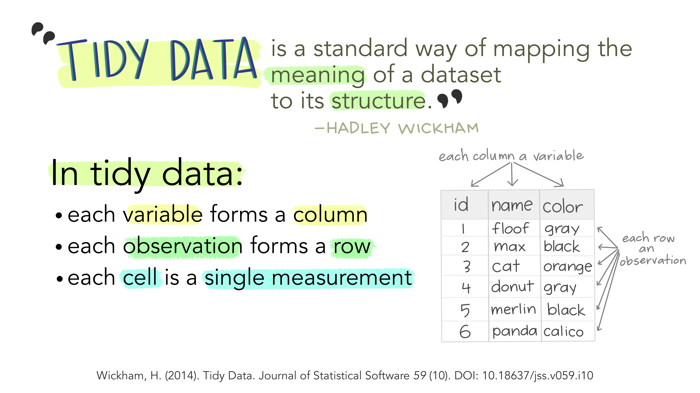
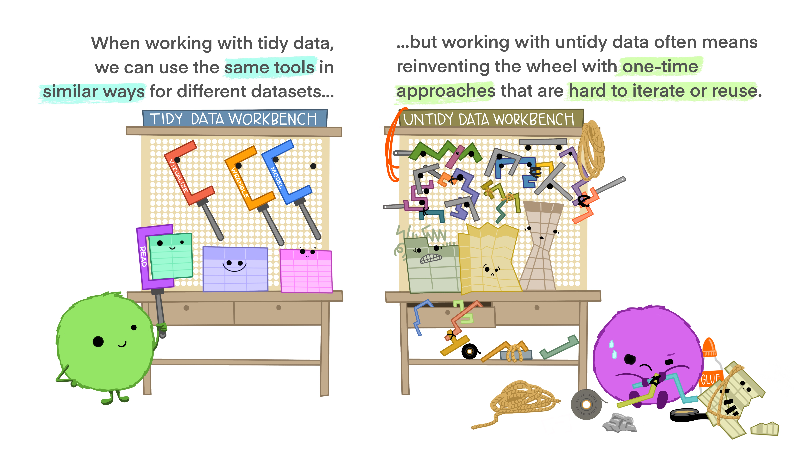
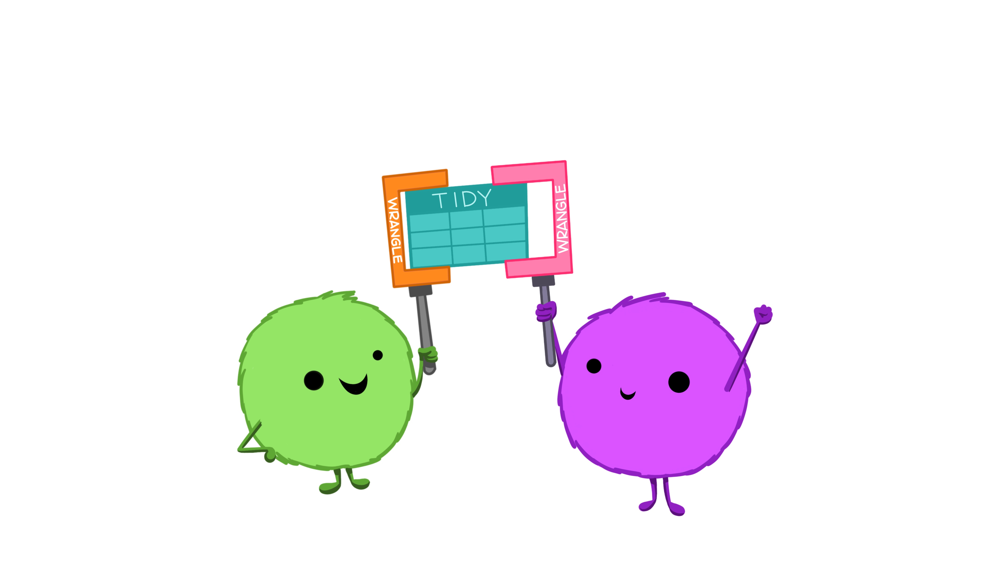
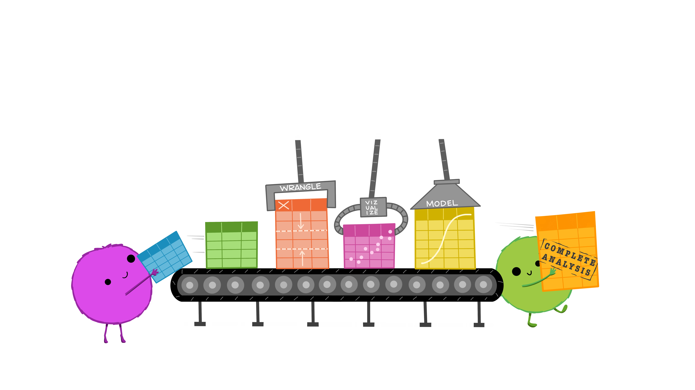
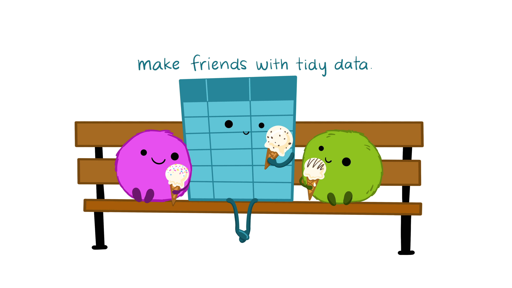
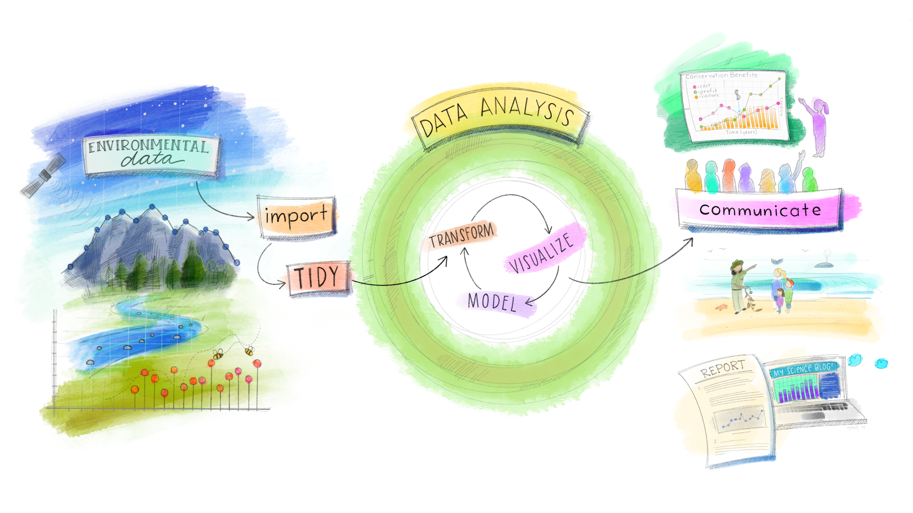
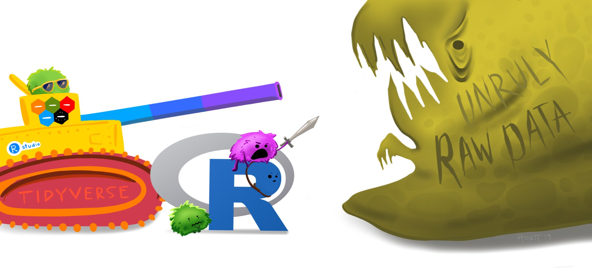

# (PART\*) Data Manipulation {-}

```{r setup, include=FALSE}
knitr::opts_chunk$set(strip.white = TRUE)
```

```{r libraries}
library(tidyverse)
```

So far in this class, we have learned the basics of how to code in R and we have learned about how to make graphs and visualizations. The next step is *data manipulation*, also known as data tidying, data wrangling, data cleaning, etc. The skills you learn in this unit will help you take a large, messy, and/or unwieldy dataset and make it more manageable, more graphable, and, crucially, more analyzable!

# Tidy Data and Tidyverse

In this class, you already encountered the `tidyverse` package. In this unit, we'll learn a lot more about this package and it's many useful functions. Before getting to that, we first need to talk about what form of data is easiest to work with. What should be the end goal of any data manipulation that we do? The answer is: *tidy data*.

## Tidy Data {#Tidy-Data}

You can represent the same data in many different ways. In almost all cases, the best way to do so is to make sure your data is **tidy**. In tidy data, each row corresponds to a unique observation, each column is a variable, and each cell contains the value for a particular observation and variable.

The series of illustrations below helps explain the concept of tidy data and why it is useful!

What is tidy data?

{width=100%}

Tidy data are like families.

{width=100%}

Since you know all sets of tidy data will have the same structure, the same tools can be used across different datasets.

{width=100%}

This enables universality with the tools being used, rather than all different people trying to accomplish the same task in different ways.

{width=100%}

This makes your own life better by making it easier for automation & iteration across your projects and datasets.

{width=100%}

It also makes all other tidy datasets seem more welcoming!

{width=100%}

{width=100%}
<p style="font-size:6pt">Illustrations from the Openscapes blog Tidy Data for reproducibility, efficiency, and collaboration by Julia Lowndes and Allison Horst.</p>

## Tidyverse

`tidyverse` is a collection of packages that all "share an underlying design philosophy, grammar, and data structure" of tidy data. The tidyverse packages and functions are the tools you will use to fill your R workbench, and they will help with every step of your workflow. Maybe of the most helpful functions that we will learn this unit come from the package `dplyr`.

{width=100%}
<p style="font-size:6pt"> Updated from Grolemund & Wickham's classis R4DS schematic, envisioned by Dr. Julia Lowndes for her 2019 useR! keynote talk and illustrated by Allison Horst.</p>

This illustrates the Social/Data Science workflow that the tidyverse suite of packages are designed to help you accomplish:

* **Import** -- get data into R

* **Tidy** -- clean and format the data

* **Transform** -- select variables, create new ones, group and summarize

* **Visualize** -- look at the data in different ways

* **Model** -- ~~answer questions about the data~~
  + *we will cover this is the next unit on statistics*

* **Communicate** -- write reproducible research reports

This unit will build your arsenal with tidyverse tools to help manage unruly raw data, as it will almost certainly be the case that the data you get initially will be very messy and need lots of cleaning and prepping!

{width=100%}
<p style="font-size:6pt">Artwork by @allison_horst</p>

## Investigating Data

One of the first things you should do when working with a new dataset is to actually look at it. This might seem obvious and simple, but it is very important because it allows you to get a sense of what type of wrangling and manipulation you may need to apply to be able to work with that data.

### View Full

You can view a data object by using the `View()` function. To inspect the `penguins` object you can run `View(penguins)` or click on the object itself in your RStudio's global environment panel.

### glimpse

Often times datasets are very large and it is impractical to try and comb through the whole file. It would be much more helpful if there was a way to quickly glimpse at your data to get an overall impression of it. There is a very appropriately named function for this: `glimpse()`!

```{r}
dplyr::glimpse(penguins)
```

From this one function alone, you can learn a lot about your data:

1. The names of the variables (columns), which you also can get with `names()`.

2. The number of observations (rows, `r nrow(penguins)`) and variables (columns, `r ncol(penguins)`). You can also get this information with the `nrow()` and `ncol()` functions.

3. These variables are saved as either "fct" (factors), "dbl" (double-precision), or "int" (integers).

<!-- <div class="panel panel-success"> -->
<!--   <div class="panel-heading">**EXERCISE 6**</div> -->
<!--   <div class="panel-body"> -->
<!--   1. Use `glimpse()` to exam the `msleep` dataset.<br> -->
<!--   2. What information have you learned about this dataset from the output?</div> -->
<!-- </div> -->

### head

`glimpse()` gives you a high level snapshot of your data, but it can also be useful to look at some actual rows of data. Looking at all of them at once is silly though. You really just want to look at a few observations to see if you can recognize anything that may need to be corrected. The `head()` function can be used for this. It will print the first few rows of data in the argument you pass it to. 

```{r}
head(penguins)
```

You can specify the exact amount of rows you want to print by passing a second argument to `head()` that specifies the number of rows. E.g.,

```{r}
head(penguins, 10)
```

