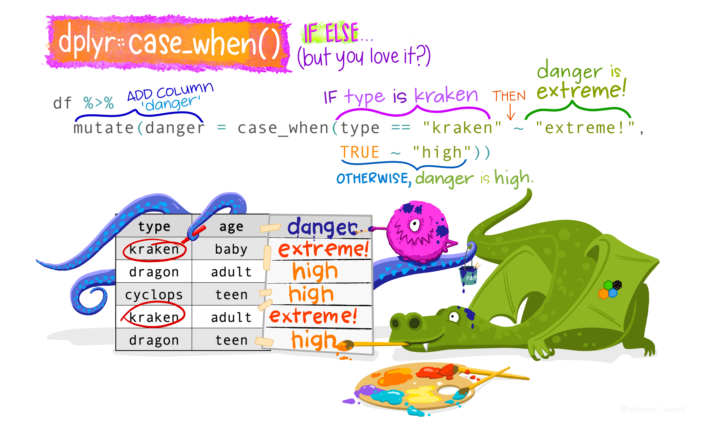

# Advanced Variable Changing

```{r setup, include=FALSE}
knitr::opts_chunk$set(strip.white = TRUE)
```

```{r message=FALSE, warning=FALSE}
library(tidyverse)
library(palmerpenguins)
```

## Change Variable Types

One of the ways in which it *is* appropriate to modify a variable is when you need to change the *type* of data it contains. In R, you can change data type by using the `as.*` function. For example, `as.logical()` changes the passed values to be *logical.* The one exception is that when changing something to a *factor*, you should use `factor()` (more on this below.)

```{r}
mtcars2 %>%
  mutate(mpg = as.character(mpg),
         cyl = factor(cyl)) %>%
  glimpse()
```

::: {.rmdimportant}
**This modifies the data in the `mpg` column to be of *character*, and the data in the `cyl` column to be a factor. The output of this is then piped to `glimpse()` so the types of each column will be displayed.**
:::

You can see from this output that all the numbers in `mpg` have quotes around them. Also, it is labeled "<chr>" and not "<dbl>". While the raw data for `cyl` look unchanged, you can see it now says "<fct>".


### Factors

Factors are important, and can be a little tricky to work with, so they get their own section. Factors are categorical data that have a specific order, and by proxy a specific defined range of possible values (e.g., Months of the year). 

#### Factor Conversion

When working with factors, particularly when converting data to and from a factor, you have to be very careful. Consider the following:

```{r}
data.frame(test = factor(c("0", "1")))
```

This simple dataframe that has one column with data as a factor with the values 0 and 1. Say you want to change that data from a factor to numeric. Simple enough, just apply the appropriate `as.*` function (`as.numeric()`).

However, observe the output from doing so:

```{r}
data.frame(test = factor(c("0", "1"))) %>% 
  mutate(test = as.numeric(test))
```

This is obviously not what was intended. What is happening here is `mutate()` is taking the *level* of each value, with `0` being level 1 and `1` being level 2. Instead, you have to circumvent this issue by first converting the values to a *character*, and then a *number*:

```{r}
data.frame(test = factor(c("0", "1"))) %>% 
  mutate(test = as.character(test),
         test = as.numeric(test))
```

The take-home point is to always double check that your code is doing what you intend it to, especially when converting to and from a *factor*!

#### Reorder Levels

While the levels of a *factor* are ordered, you may at times want to change what that order is. One of the more common instances when this will occur is in visualizations. Consider the following:

```{r}
mtcars2 %>%
  mutate(cyl = factor(cyl)) %>%
  ggplot(aes(x = cyl, fill = cyl)) +
    geom_bar(position = "identity")
```

The x-axis has a sensible arrangement, but this 1. is a function of the fact that the factors happen to be numbers, 2. is not particularly aesthetically pleasing when looking at the actual bars. The bars themselves have an inherent ordering and it may make more sense to organize them as such. This can be accomplished using `fct_infreq()`, which will reorder the levels of a factor **in** their **freq**uency of occurrence (with highest frequency first).

```{r}
mtcars2 %>%
  mutate(cyl = factor(cyl) %>%
           fct_infreq()) %>%
  ggplot(aes(x = cyl, fill = cyl)) +
    geom_bar(position = "identity")
```

To order the levels with lowest frequency first, you can use `fct_rev()` for "**rev**erse **freq**uency". 

```{r}
mtcars2 %>%
  mutate(cyl = factor(cyl) %>%
           fct_infreq() %>%
           fct_rev()) %>%
  ggplot(aes(x = cyl, fill = cyl)) +
    geom_bar(position = "identity")
```

<p class="text-info"> **<u>Note:</u> Notice that the color mapping is changing as well. In the bottom graph, the blue bar is on the 4 cylinder bar, whereas on the preceding graph it was on the 6 cylinder bar. This is because color mappings correspond to factor levels!**</p>

Most of the time you will not be creating graphs to visualize counts of a single variable. Instead, you will be visualizing the relationship or comparison between two more more variables, like in the graph below:

```{r warning = FALSE}
mtcars2 %>%
  mutate(cyl = factor(cyl)) %>%
  ggplot(aes(y = mpg, x = cyl)) +
  stat_summary(fun.data = "mean_se", geom = "pointrange")
```

To reorder the levels of a factor by their relationship with another variable (instead of frequency of occurrence), you can use `fct_reorder()`. In `fct_reorder()`, you must specify the factor to reorder, and the other variable you wish to reorder the levels by. By default, `fct_order()` will use the median. To change this, you must specify the exact function (similar to how we do in `stat_summary()`).

```{r warning = FALSE}
mtcars2 %>%
  mutate(cyl = factor(cyl)) %>%
  ggplot(aes(y = mpg, x = fct_reorder(cyl, mpg, .fun = "mean"))) +
  stat_summary(fun.data = "mean_se", geom = "pointrange")
```

<p class="text-info"> **<u>Note:</u> `fct_reorder()` was used in the ggplot call directly because this is a fairly particular reordering. It is unlikely that, outside of for the purpose of generating this specific visualization, you would want the levels of `cyl` to be ordered based on its level of `mpg`.<br><br>Also, you can combine `fct_reorder()` with `fct_rev()` to reverse the order of the levels.**</p>

## Advanced Mutating

### Mutating `across()`

`mutate()` was [previously](#Modifying-Existing-Variables) used to make changes to the data in our columns. To do so, you had to specify the specific column you wanted to change and what you wanted to do to it. However, utilizing the `across()` function, you can instead apply some changes to **multiple** columns simultaneously!

`across(selection_of_columns, NAME of function to apply to each)`

For example, if you wanted to `scale()` specific columns:

```{r}
dat %>% 
  mutate(across(c("Q2", "Q3"), scale)) %>%
  select(c("Q2", "Q3")) %>%
  head(10)
```

Just like in the `if_*()` calls, because the first argument of `across()` expects a selection of columns, you can use helper functions to make these selections as well!

```{r}
dat %>% 
  mutate(across(starts_with("Q"), scale)) %>%
  select(starts_with("Q")) %>%
  select(1:7) %>%
  # Take just the first 7 columns
  # to save space
  head(10)
```

<p class="text-info"> **<u>Note:</u> All of the `select()` calls were added only to save space and make these notes easier for you to understand by highlighting the specific rows that are changed. Without the `select()` calls, this code will output all of the data (which is what you want!). `select()` calls are NOT something that should *always* be used in your code with `mutate(across())`.**</p>

You can combine `where()` with `across()` to mutate conditionally. In other words, **IF** the column passes some test, the function will be applied to all its values.

Consider the following scenario: say you wanted to convert all the *factors* to *characters*.

First, you would check which columns contain *factors*:

```{r}
dat %>%
  select(where(is.factor)) %>%
  glimpse()
```

Next, you can use `across()` and `where()` to change only columns that are *factors* into *characters*, checking which columns are *characters*. The columns that were previously *factors* should show up here.

```{r}
dat %>% 
  mutate(across(where(is.factor), as.character)) %>%
  select(where(is.character)) %>%
  glimpse()
```
  
Which they do!

<p class="text-info"> **<u>Note:</u> `glimpse()` was added here only to make these notes easier for you to understand. Without `glimpse()`, this code will just output the actual data (which is what you want!). `glimpse()` is NOT something that should *always* be used in your code with `across()` or `where()`.**</p>

As before, multiple helper functions can be strung together with operators and they can also be negated with `!`. For example:

```{r}
dat %>%
  mutate(across(where(is.numeric) & starts_with("Z"), log)) %>%
  select(starts_with("Z")) %>%
  head()
```

You also can apply *multiple* functions simultaneously by `list`ing them. For example:

```{r}
dat %>%
  mutate(across(where(is.numeric) & starts_with("Z"), list(log = log, round = round))) %>%
  select(starts_with("Z")) %>%
  head()
```

Some common functions you may want to apply to columns in this way include: `mean()`, `sd()`, `round()`, `scale()`, `log()`, and many many others!

### Conditional Values

You may want a variable to have a value based on some different conditions. This can be extremely useful when creating new variables!

#### case_when() {#case_when}

`case_when()` is most useful when you have many nested tests/conditions to specify.

{width=100%}
<p style="font-size:6pt">Artwork by @allison_horst</p>

```{r}
mtcars2 %>%
  mutate(fuel_efficiency = case_when(
    mpg <= 19 ~ "Poor",
    mpg >= 20 & mpg <= 25 ~ "Average",
    TRUE ~ "Great"
  ))
```

::: {.rmdimportant}
**This creates a new variable called `fuel_efficiency`. Each observation's value for this variable depends on its value for `mpg`, and differs based on different conditions.**
:::

In more simple instances, [ifelse()] can be used:

```{r}
mtcars2 %>%
  mutate(power = ifelse(hp >=200, "High", "Low"))
```

::: {.rmdimportant}
**This creates a new variable called `power`. Each observation's value for this variable depends on its value for `hp`. If `hp` is greater than 200, it is "High" powered, if lower than 200 then "Low" powered.**
:::

## Conditional statements

The idea of mutating variables based on conditional values brings up the larger idea of *conditional statements*. These are powerful programming tools that help us manipulate data based on conditions, also known as *"if/else statements"*.

Sometimes, you will want your code to perform different actions depending on something's value. In these circumstances, it is useful to implement `if...else` statements. `if` statements work as such: 

**if** some test/condition evaluates to `TRUE`, execute some specific code. 

Other tests/conditions can be appended with `else` statements, which specify what to do when the original test/condition evaluates to `FALSE` and is based on subsequent tests/conditions. The syntax of a basic `if` statement is as follows:

```{r eval=FALSE}
if(some test/condition to evaluate) {
  code for what to do if that test/condition evaluates to true
}
```

For example:

```{r}
x = 4

if(3 < x) {
  print("The condition evaluated TRUE")
}
```

`x` was set equal to 4. R evaluates the test `3 < x` in the `if` statement, here equivalent to `3 < 4`, which evaluates to `TRUE`. Since the `if` condition evaluates `TRUE`, it runs the code in the curly brackets. 

`x` may not always be 4 though. What if `x` was not 4? What if you do not know what `x` is? If the test in the `if` statement evaluates to `FALSE`, nothing happens. If nothing at all happens, you may not know if there was an error in the code or the test just evaluated to `FALSE`. Considering this, it is always good practice to set up an alternative for when the test evaluates to `FALSE`. That is where `else` statements come in.

The code below will change `x` to be a random value, so its actual value will be unknown.

```{r}
x = sample(c(1:6), 1) # From the values 1 to 6, sample 1 value

if(3 < x) {
  print("The condition evaluated TRUE")
} else {
  print("the condition evaluated FALSE")
}
x
```

This code specifies what to do depending on whether the test evaluates to `TRUE` or if it evaluates to `FALSE`.

You can get more specific and link several conditions together. You may not want just 2 options -- e.g., something to do if a test is `TRUE` and something else done in **all** other cases. Instead of using `else`, you use `else if()` and specify another test. 

```{r}
x = sample(c(1:6), 1)

if(4 < x) {
  print("The first condition evaluated TRUE")
} else if (2 < x & x < 5) { 
  print("The second condition evaluated TRUE")
} else {
  print("Neither the first or second condition evaluated TRUE.")
}

x
```

Writing `if` statements like this is most useful when the code you want to run executes a function. As you will note above, in all instances the `print()` function was the code being executed (what is in the curly brackets). An infinite number of `if` conditions can be chained together in an `if...else` chain.


There are two alternative ways to write `if...else` statements. 

### ifelse()

`ifelse()` is most useful when you need to *return values* rather than execute some other code/function (like printing a character string).

`ifelse()` statements take the form:

`ifelse(test, the value to return if the test evaluates *TRUE*, the value to return if the test evaluates *FALSE*)`

Multiple `ifelse()` statements can be chained together, akin to an `else if` by adding a nested `ifelse()` call in place of the `FALSE` argument.

The examples below demonstrates this:

```{r}
x = sample(c(1:6), 1)

ifelse(4 < x, "The first condition evaluated true.",
       ifelse(2 < x & x < 5, "The second condition evaluated true.", 
              "Neither the first or second condition evaluated true."))

x
```

### case_when()

As shown above, `case_when()` can be used in combination with `mutate()` or on its own:

```{r}
x = sample(c(1:6), 1)

case_when(
  x < 4 ~ "The first condition evaluated true.",
  2 < x & x < 5 ~ "The second condition evaluated true.",
  TRUE ~ "Neither the first or second condition evaluated true."
)

x
```

**In sum:**

- Traditional `if...else` statements are useful when you need the result to execute some code.
- `ifelse()` and `case_when()` are useful when you need the result to be a specific value and are often used to create new data or variables.

## Loops

Loops are used to repeat certain code iteratively, for example when you want to apply the same code to each element in a sequence (e.g., columns in a dataframe, elements in a vector, etc). The basic syntax of a "for" loop is as follows:


```{r eval=FALSE}
for (val in sequence) 
  {code to be executed}
```

The `for` initiates the for loop, `val` is completely arbitrary and can be replaced with any character string. Conventionally it is just the letter `i`, and subsequently `j` then `k` if you are doing nested for loops (loops within loops).

For a simple use case, imagine the following scenario:

You are a undergraduate TA and are helping the professor with an exam. You have a series of exam scores `c(1:10)`. The professor was feeling generous and wants to curve the scores by 1 point. It would be pretty annoying to have to try and manually change each value. Instead, you can do this automatically with a `for` loop!

```{r}
x = c(1:10) # Exam scores

for (i in 1:length(x)) {
  x[i]= x[i] + 1 # Set the ith X to be equal to itself + 1
  # This will be iterated through each value in x
}

x # Look at output to verify changes
```

Breaking down the code above step by step: First a `for` loop was initiated, saying you wanted to iterate over each element in the sequence 1 to `length(x)`. The `length()` function returns the number of elements in the object you pass it. Then it was specified that the ith element of `x` should be replaced with the value resulting from the sum of that value + 1 (`x[i] + 1`). The value of `i` will change in each iteration of the loop. It starts with 1 (because that is what the code tells it to do with the `1:` part), and increments by 1 each iteration, iterating `length(x)` times. 

::: {.rmdcaution} 
**`1:length(x)` was used instead of just 10 (the number of elements in the vector x) above to keep the code dynamic. This illustrates an important coding principle: <u>soft coding</u> vs <u>hard coding</u>. Hard coding is static and unchanging, whereas soft coding is dynamic. What does this mean? Well, `x` may not always have 10 exam scores. Maybe you have some students who take their exams with OSD, and you have to wait a few days to get their exams back. You want to be able to run the same code without making any modifications. If `1:10` is used in the `for` loop, then when the new exam scores are added to `x`, the code won't run on all exams! The `for` loop is specificed to explicitly iterate over the range 1:10. However, by using `1:length(x)`, `length(x)` will always be replaced by the exact number of elements in the vector `x`! This way, the same code can be used no matter how many exam scores you have! Generally speaking, you <u>always</u> want to soft code and make your code dynamic.**
:::

`for` loops are often combined with `if` statements to apply conditional code iteratively through your data. 

{width=100%}
<p style="font-size:6pt">Artwork by @allison_horst</p>

Imagine that instead of needing to add a bonus point to every exam, you need to give *particular* students a bonus if they completed a SONA experiment for extra credit.

This can be accomplished by adding an `if` statement to the code executed executed in each iteration:

```{r}
y = data.frame("Exam" = c(1:4), 
               "Score" = c(88,90,77,98), 
               "Student" = c("Dave", "Ally", 
                             "Tyreek", "Jeanie"), 
               "Sona" = c(0,1,1,0))

y

for (i in 1:nrow(y)) { 
    # Use nrow for a dataframe
  if(y$Sona[i] == 1){ 
    # $ to index -- You want the y dataframe, 
    # the Student column, and the ith row. 
    y$Score[i] = y$Score[i] + 5 
          # For every row in the Score column of 
          # the y dataframe, if the condition y$Sona[i] == 1 
          # evaluates to TRUE, that value is going to be 
          # equal to what is currently there + 5.
  }
}
```

The same task can be accomplished using `ifelse()`, since the goal here is to return values:

```{r}
y = data.frame("Exam" = c(1:4), 
               "Score" = c(88,90,77,98), 
               "Student" = c("Dave", "Ally", 
                             "Tyreek", "Jeanie"), 
               "Sona" = c(0,1,1,0))

for (i in 1:nrow(y)) {
  y$Score[i] = ifelse(y$Sona[i] == 1, # Test
                      y$Score[i]+5, # What to do if TRUE
                      y$Score[i]) # What to do if FALSE
}

y
```

You can see that only Ally and Tyreek's scores, the students who completed the SONA extra credit, have changed.

## Text Cleaning

More often than not, when working with text responses or any sort of character data output, it will initially be very difficult to work with. This is the case both when dealing with qualitative data and sometimes even just from the output of your data collection means (Qualtrics, Googleforms, etc.). What follow are some common cleaning procedures.

### Remove Text From Strings

Say your data output included a "Response:" before each response. Obviously, you would want the variable to just contain the actual response values. You can use `str_remove_all()` to remove a specified pattern from a text response. Here, removing "Response:".

```{r}
x = "Response:Apple Juice"
x

x = str_remove_all(x, "Response:")
x
```

### Escaping Special Characters

In many programming languages, dealing with special characters is difficult. The language has trouble deciding if you are trying to **use** the character or just *refer* to it.

Consider the example below:

```{r error = TRUE}
x = '{Response:"Apple Juice"}'
x

str_remove_all(x, '{')
```

Instead, you have to do what is called "escaping" a special character. One way to do so in R is to wrap the character in brackets.

```{r}
x = '{Response:"Apple Juice"}'
x
str_remove_all(x, '[{]')
```

Now this raises the question of what do you do when you want to escape a bracket? You can do so with double forward slash.

```{r}
x = '[Response:"Apple Juice"]'
x
str_remove_all(x, '\\[')
```

<p class="text-info"> **Note: Double forward slash (\\) can be used to escape any special character as well, not just brackets.**</p>

### Removing Multiple Strings at Once

You can remove multiple strings at once by using `paste()` to include all the characters or strings you want removed.

```{r}
x = 'Response:{"Apple Juice"}'

str_remove_all(x, paste(c('Response', '[:]', '[{]', '["]', '[}]'), 
                        collapse='|'))
```

### Removing the First Instance

Sometimes, you do not want EVERY instance of a string removed. In the example below, the string "Answer" is actually part of a participant's response. This should not be removed!

```{r}
x = 'Response:{"Apple Juice Response"}'

str_remove_all(x, paste(c('Response', '[:]', '[{]', '["]', '[}]'), 
                        collapse='|'))
```

If we removed things as we had been before, we'd lose part of their response! Instead, we can just remove the *first* instance of a string by using `str_remove()`

```{r}
x = 'Response:{"Apple Juice Response"}'

x = str_remove_all(x, paste(c('[:]', '[{]', '["]', '[}]'), 
                            collapse='|'))
x

str_remove(x, "Response")
```

::: {.rmdimportant}
**This first gets rid of all the other text strings that are to be removed by using `str_remove_all()` as before. Then, to deal with the extra "Response", `str_remove()` is used, and only the first instance is removed.**
:::

### Replace Parts of a Response

Sometimes you will not want to only **remove** part of a response but also **replace** it with something else. Whereas the `str_remove()` function will simply remove the string, `gsub()` will substitute it with something else that you specify!

`gsub()` takes the form:<br>
`gsub(string to replace, what to replace with, where to look)`

```{r}
x = "foo:bar"

str_remove(x, ":") # Not what you want

gsub(":", " ", x) # What you want!
```

## Extras

* [Factors cheatsheet](https://github.com/rstudio/cheatsheets/blob/main/factors.pdf)

## References