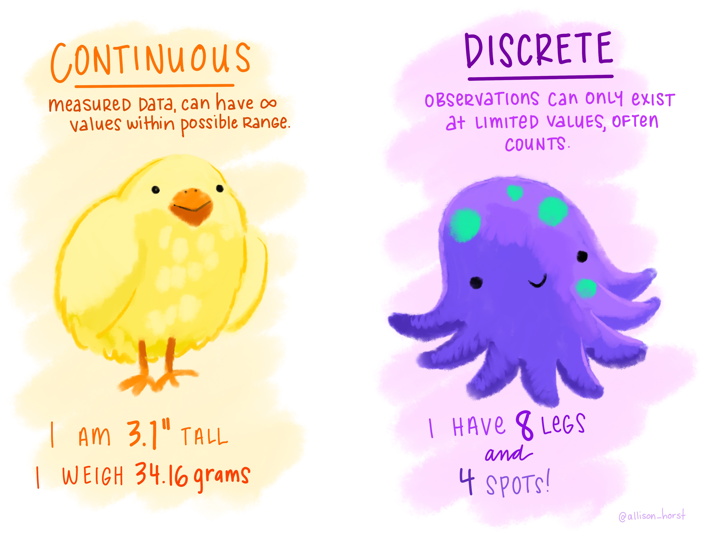
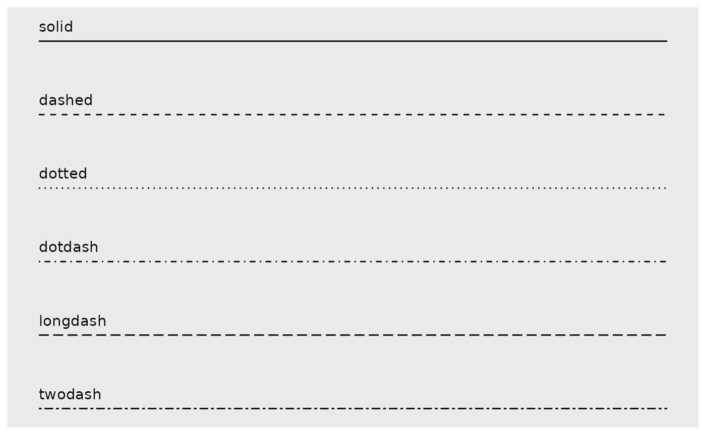
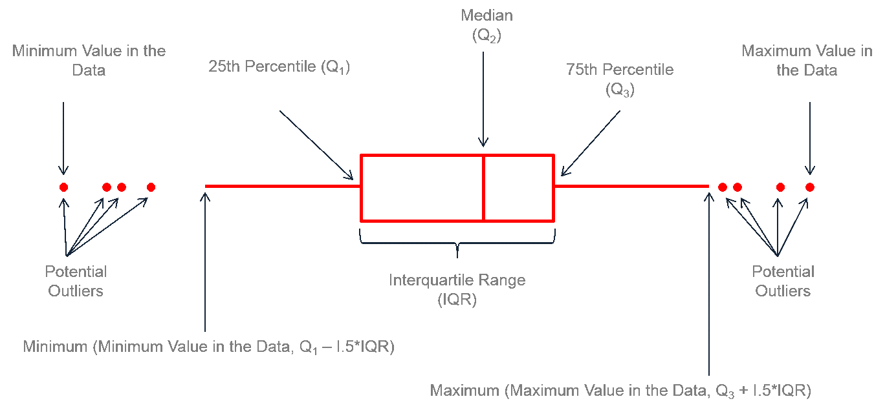
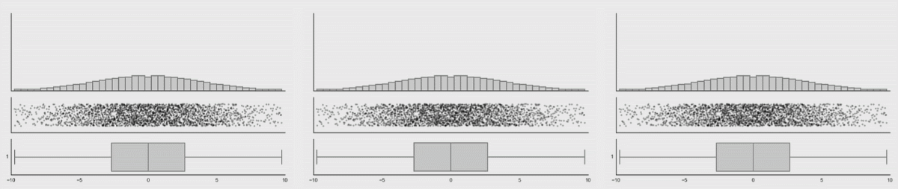

# Different Geoms and When To Use Them

```{r setup, include=FALSE}
knitr::opts_chunk$set(strip.white = TRUE,
                      warning = FALSE,
                      message = FALSE)
```

```{r message=FALSE, warning=FALSE}
library(tidyverse)
library(palmerpenguins)
```

<!-- <a href="exercises/Exercise_Viz2.Rmd" download>Exercise Sheet</a> -->

Previously, it was stated that the point of a visualization is to explore and understand a relationship or pattern in your data (often between an outcome variable and one or more explanatory/predictor variables). It is important to know how to best graphically represent your data based on the types of variables (categorical vs continuous) you have and the relationships or patterns you are trying to visualize. There are a number of ways you can visualize specific types of relationships. Some are better than others, and sometimes what is "best" depends on the specific context. 

Recall from your statistics course (and Chapter 2 of this text) that we can divide the data we usually use in psychology into two types: categorical and continuous. *Categorical* data, also called qualitative or discrete, contains discrete categories like color (blue, pink, purple), species (sparrow, robin, pigeon), and experimental group (treatment, control). This data is often (but not always) a string or character variable. *Continuous* data, also called quantitative or numeric, is the kind of thing you can count like height, weight, age, or (for psychologists) Likert scale ratings. This is a numerical variable. Deciding what type of graph to use (and later, what type of statistical test) depends on if the variables you are interested in are categorical or continuous, and how many of each you have.

{width=100%}
<p style="font-size:6pt">Artwork by @allison_horst</p>

What follows here is an overview of a number of different ways you can visualize these different types of data and relationships, as well as recommendations as to which are best and when. 

# One Variable

## One Categorical

Graphing one categorical variable is used to show counts of that variable. This is most commonly used as an initial visualization of your data to check against your statistics.

### Bar

One good way of visualizing a single categorical variable is with a bar chart.

Think about the following question:

> "How many penguin observations do we have from each island?"

Let's create a visualization that has a bar for each island, and that bar's height corresponds to the number of penguins recorded on that island. To do so, we will use `geom_bar()` which creates a bar graph of counts. Notice that there's only one variable `x`. ggplot will automatically count the number in each group to create the y variable (number of penguins on each island).

```{r}
penguins %>%
  ggplot(aes(x = island)) + 
  geom_bar()
```

This way, we can see the distribution of penguins across the three islands. Why island has the most penguins? Which has the least?

<!-- <div class="panel panel-success"> -->
<!--   <div class="panel-heading">**EXERCISE 1**</div> -->
<!--   <div class="panel-body">Create bar plots to explore both the count and proportion of penguins of each species. Try out different aesthetic **<u>settings</u>**, and see how they change the graph (if you want to try an aesthetic **<u>mapping</u>**, only use the singular variable on your x-axis).</div> -->
<!-- </div> -->

### Pie

Another option when dealing with one categorical variables is a pie chart. However, pie charts have a tendency to misrepresent data, so I don't recommend using them. Also, there is no geom in ggplot specifically for a pie chart, so the are also complicated to make! We won't use them in this class, so you do not have to worry about understanding this code. You may, unfortunately, find yourself working with someone who wants to use a pie chart. I include this code here so you have a template for those scenarios.

```{r}
penguins %>%
  ggplot(aes(x = 1,
             fill = species)) +
  geom_bar() +
  coord_polar("y", start = 0)
```

More information on why it is recommended to avoid using pie charts can be found [here](https://www.data-to-viz.com/caveat/pie.html) (stop before the "Alternatives" section).

::: {.rmdcaution} 
**When you are creating a visualization to communicate something about a single categorical variable, you can also use a table instead of a graph.**
:::

## One Continuous

**Looking at distributions**

Being able to understand and characterize distributions is an integral part of the Social/Data Scientist's toolbox. When you want to know more about the distribution of a particular continuous variable in your dataset, you have a few options available to you.

### Histogram

One of the most powerful tools you have for examining distributions is the **histogram.** In a histogram, values of the variable of interest are separated into different bins on the x-axis. It's kind of like a bar graph, except the x-axis is separated into arbitrary bins of different sizes (like 1 or 10) instead of discrete categories. So, for example, all penguins with a flipper length of 190 to 200 mm might be in the same bin.

As in the bar graph above, the y-axis of a histogram will most often represent the *frequency* or *count* of some value or range of values in the distribution.

```{r message=TRUE}
penguins %>%
  ggplot(aes(x = flipper_length_mm)) +
  geom_histogram()
```

In the histogram above, the height of the bars does not correspond to how long a penguin's flipper was, but rather the number of penguins in this sample with flipper lengths of a particular range/value. For example, it looks like ~28 penguins in this sample had flipper lengths around 190mm.

It is a little difficult to tell the difference between each individual bar though. Giving them an outline would help with this tremendously. You can do this with the color aesthetic. Remember, *'color'* often refers to the outline/outside, while *'fill'* often refers to the inside.

```{r message=TRUE}
penguins %>%
  ggplot(aes(x = flipper_length_mm)) +
  geom_histogram(color = 'black')
```

#### Bins

You may have noticed a weird message coming out with the histograms so far:

<p style="color:#A79BF0"> **stat_bin() using bins = 30. Pick better value with binwidth.**</p>

"**bins**" refers to the actual number of bins (bars) in your histogram. "**binwidth**" refers to the width of each bin (bar), in other words how many units in x wide each bin (bar) is. Setting a value for "**binwidth**" will override the number of "**bins**", which is why R is suggesting you change that value. 

In a histogram, the difference of binwidth size can significantly impact how your graph looks. This, in turn, will influence what kind of impressions and inferences you make. For this reason it is **very important** to explore different bin settings and verify whether the patterns you notice are truly a feature of your data or just an artifact of your bin settings!

Consider the example below:
  
```{r}
penguins %>%
  ggplot(aes(x = flipper_length_mm)) +
  geom_histogram(color = 'black',
                 bins = 5)
penguins %>%
  ggplot(aes(x = flipper_length_mm)) +
  geom_histogram(color = 'black',
                 bins = 15)
```

In the first histogram you would probably say this is a *unimodal* distribution (one peak) with most of the flipper lengths around 190mm (+/- a few). However, when looking at the second histogram, you would probably say this distribution looks more *bimodal* (two peaks), with one cluster around 190mm and another around 210mm. The same data, visualized using the same type of graph, but two different stories based on choices that you made. You have to be very careful to make sure you are telling the **<u>data's</u>** story, not *your* story! In this case, it would probably be better to use a smaller bin size, to show that there is a dip in the middle of the distribution.

<!-- <div class="panel panel-success"> -->
<!--   <div class="panel-heading">**EXERCISE 2**</div> -->
<!--   <div class="panel-body">Make a histogram to explore the distribution of `body_mass_g` scores in your dataset. Try out different aesthetic **<u>settings</u>** and see how they change the graph. Also, try different bin settings (size and width) and see how they change your interpretation/understanding of the data.</div> -->
<!-- </div> -->

### Density

**density plots**, in short, are a smoothed histogram. If you are particularly stats-minded and want further information, you click below for some further info. 

<button class="btn btn-primary" data-toggle="collapse" data-target="#BlockName"> Advanced </button>  
<div id="BlockName" class="collapse">  
Density plots show probability density (not *actual* probability!) on the y-axis. What does that mean exactly? Well, it is a little complicated. In short, a continuous curve (aka kernel) is fit to each individual data point. All the curves from each individual data point are summed and that forms the curve fit by the density plot or the whole dataset. For those interested in more info, check [here](https://towardsdatascience.com/histograms-and-density-plots-in-python-f6bda88f5ac0) for a fairly approachable explanation.
</div>
<br>
Use `geom_density()` for a density plot.

```{r}
penguins %>%
  ggplot(aes(x = flipper_length_mm)) +
  geom_density()
```

To better understand the density plot, it helps to see how it overlays the histogram:

```{r}
penguins %>%
  ggplot(aes(x = flipper_length_mm)) +
  geom_density(size = 1)+
  geom_histogram(aes(y=..density..), color="black", alpha=0.2)
```

You can see that, by smoothing, density plots obscure some of the noisiness (variability) in your data.

<!-- <div class="panel panel-success"> -->
<!--   <div class="panel-heading">**EXERCISE 3**</div> -->
<!--   <div class="panel-body">Take your plot from Exercise 2 and add a colored line approximately where you think the mean would be. Add another line in a different color where you think the mode would be.</div> -->
<!-- </div> -->

# Two Variables

## 2 Categorical Variables

This is a variation on visualizations for one categorical variable, just adding a second variable to the x-axis with an aesthetic mapping. This should look familar from last week.

```{r}
# color
penguins %>%
  ggplot(aes(x = island, fill = species)) + 
  geom_bar()

```

All you do here is add the `fill=` mapping aesthetic and set it equal to `species` (the other categorical variable in the data), while `island` is the x value. 

Unfortunately, these graphs are kind of hard to interpret because of the stacking. In the additional aesthetics section below, we'll learn about some arguments that make it easier to make readable stacked graphs (specifically the idea of positions and dodging).

## 2 Continuous Variables

When exploring the relationship between two continuous variables, there are two main visualizations you can work with: **scatter plots** and **2d histograms**. Which one you pick will be the size of the dataset you are trying to visualize.

### Scatter plot

As you will recall from previous lessons, you use `geom_point()` to create scatter plots. In a scatter plot, each point on the visualization represents an observation in your data.

```{r}
penguins %>%
  ggplot(aes(y = body_mass_g, x = bill_depth_mm)) +
  geom_point()
```

It can sometimes be a good idea to include a line of best fit to show the trend of your data. This can aid in seeing patterns in your data. As we discussed, you can do this with `geom_smooth()`. 

(Recall that the two main arguments of relevance for now are `method=` and `se=`. The `method=` argument gets set to "lm", saying you want to fit a line from the linear model. `se=` refers to whether or not to show the Standard Error of the line.)

```{r}
penguins %>%
  ggplot(aes(y = body_mass_g, x = bill_depth_mm)) +
  geom_point() +
  geom_smooth(method = 'lm', se = FALSE)
```

Well... Hang on. This... okay yes it **IS** a line, but this may not be what you were expecting to see. This highlights an important point: <u>**Just because you CAN fit a line to something does not always mean you should.**</u> 

Use scatter plots for datasets with **lower numbers of observations only**. Even with some alpha adjustments, datasets with large n's (number of observations) can look pretty gnarly:

```{r}
diamonds %>%
  ggplot(aes(y = table, x = depth)) +
  geom_point(alpha = 0.1)
```

<!-- <div class="panel panel-success"> -->
<!--   <div class="panel-heading">**EXERCISE 4**</div> -->
<!--   <div class="panel-body">Create a visualization to explore the relationship between a penguin's `bill_length_mm` and their `flipper_length_mm`. Try out different aesthetic **<u>settings</u>**, and see how they change the graph.</div> -->
<!-- </div> -->

### 2d Histogram

Alternatively, when working with a dataset that has a **large n**, you can use a 2d histogram with `geom_bin2d()`.

```{r}
penguins %>%
  ggplot(aes(y = body_mass_g, x = bill_depth_mm)) +
  geom_bin2d()
```

Like a scatter plot, each point represents an observation. However, the graph also shows some information about how many observations may be occupying the same/similar space. In this example, the lighter the spot, the more concentrated the observations in that spot.

<!-- <div class="panel panel-success"> -->
<!--   <div class="panel-heading">**EXERCISE 5**</div> -->
<!--   <div class="panel-body">Create a visualization to explore the relationship between a penguin's `bill_length_mm` and their `flipper_length_mm`. Specifically, create a visualization if you had anticipated having a large n. Try out different aesthetic **<u>settings</u>**, and see how they change the graph.</div> -->
<!-- </div> -->

## 1 Continuous, 1 Categorical

Arguably, the most common thing you will create a graph to visualize is a *comparison* of data from different conditions (categories) of some variable. Specifically, to compare values of a continuous variable between categories. For example: 

> How does the average weight (`body_mass_g`) of the penguins compare across islands (`island`)?

Maybe it is the case that some islands have better food sources than others, and the penguins there can gorge themselves into a food coma all day long while the penguins on other islands go hungry.

There are a **<u>LOT</u>** of options for how to visualize comparisons of this kind. Which graph you choose depends on what information you want to convey: summary statistics (mean, median, etc.), variability (error, raw data points), or all of the above! We'll walk through examples of each type of graph (this is a long section, but very useful!).

### Graphing summary statistics

First, we'll look how to graph summary statistics, specifically the mean, of a continuous variable by category. There are three different types of graphs we'll examine: bar graphs, point graphs, and lines graphs.

#### Bar graph

The most common visualization for 1 continuous and 1 categorical variable is the bar chart, using `geom_bar()`. When we were looking at 1 categorical variable above, we didn't need to input any arguments into this function because we were using the built-in defaults, including the desired statistic of `count`. Now, we want the bar to represent the mean of our y variable (`body_mass_g`), so we need to specify a different statistic. The mean is called "summary" for geoms, so the argument for this is `stat = "summary"`.

<p style="font-size:10pt">Going forward, the habit of making predictions for and/or summarizing the visualizations you create will be brought back. A formal prediction (hypothesis) will first be declared by specifying two mutually exclusive alternative patterns that *could* be observed in the visualizations. The subsequent predictions can just refer to that initial hypothesis rather than explicitly stating it. After making the visualization, a <u>short</u> summary of what the visualization shows will be written.</p>

::: {.rmdwarning}
*Prediction:* "If it is the case that the differences in penguin weight could be explained by what island they live on (e.g., penguins on some islands are heavier on average than penguins on other islands), then some bars should be higher or lower than the others. If it is not the case that the differences in penguin weight could be explained by what island they live on, the bars should all have roughly equivalent heights."
:::

```{r}
penguins %>%
  ggplot(aes(y = body_mass_g, x = island)) +
  geom_bar(stat = "summary")
```

::: {.rmdimportant}
*Summary:* In the visualization you can see that, generally speaking, penguins on Biscoe island seem to be the heaviest and heavier on average than penguins on either Dream or Torgersen island. The penguins on Dream and Torgensen island seem to have similar weight. You can see this pattern by noticing that the bar representing Biscoe island is higher than the bars for Dream and Torgersen islands (which are both about the same height).
:::

Because we used `stat = "summary"`, the height of each bar here shows the *mean* of the continuous variable (body mass) for each category in the categorical variable (island), not *counts* of observations.

#### Point

Instead of representing the means with a bar geom, you could do the same with a **"point"**. This will use the `geom_point()` function with the `stat = "summary"` argument so that, instead of making a scatterplot, it will only show points for the mean body mass on each island.

```{r}
penguins %>%
  ggplot(aes(y = body_mass_g, x = island)) +
  geom_point(stat = "summary")
```

Compared to when the means were represented with bars, the difference between the average weight of penguins on Biscoe island to the other two islands looks *much* more drastic. Why is that? It is the same data, just visualized differently. You will note that the scale of the y-axis has changed here. Instead of running from 0 - 5000 like in the bar chart, it runs from 3750 - 4750. Modifying axis scales will be covered in a later chapter, but for now this is a reminder to be mindful of scales when making your interpretation, and how the scale might skew the interpretation someone makes from your visualization!

#### Line

Another way to visualize this is with a line instead of bars or points using the `geom_line()` function and `stat = "summary"` argument. However, these types of graphs are probably best for visualizing changes in a mean over time, not comparing between different groups. That's because connecting groups with a line makes it look like there is more continuity between the groups than there actually is.

```{r message=TRUE}
penguins %>%
  ggplot(aes(y = body_mass_g, x = island)) +
  geom_line(stat = "summary")
```

Hm, okay, this did not work. R is telling you something here though:

<p style="color:#A79BF0"> **geom_path: Each group consists of only one observation. Do you need to adjust the group aesthetic?**</p>

In order to make a line, R needs to know which points you are trying to connect. It does not know how you want the individual pieces of the visualization (here, the `mean body_mass_g` for each `island`) grouped together, as each group only has one observation (a mean for each island). R even gave you a recommendation on how to fix this by asking if you need to adjust the ***group*** aesthetic! This is a new aesthetic that will be covered more later.

For now, R needs to know that all the categories in `island` should be treated as coming from the same group. This can be done by simply telling R there should be one group:

```{r}
penguins %>%
  ggplot(aes(y = body_mass_g, x = island, group = 1)) +
  geom_line(stat = "summary")
```

There are a number of different styles of line you can use by changing the `linetype`:

{width=100%}

```{r}
penguins %>%
  ggplot(aes(y = body_mass_g, x = island, group = 1)) +
  geom_line(stat = "summary", linetype = "dashed")
```

As we noted above, different geoms can also be combined in layers. For example, both `geom_point()` and `geom_line()` to make the line plot look a little cleaner.

```{r}
penguins %>%
  ggplot(aes(y = body_mass_g, x = island, group = 1)) +
  geom_point(stat = "summary") +
  geom_line(stat = "summary")
```

Again, a bar or point plot is better for comparing between groups. A line plot is better for comparing groups or people *over time*.

#### `stat_summary()`

Another way to create these graphs is using the `stat_summary()` function instead of different `geom_` functions. `stat_summary` is an extremely powerful and versatile function which can be used to create a visualization summarizing the y values for each unique x value. The `fun =` argument specifies what type of summary statistic you want to visualize for the y values. The `geom =` argument specifies how you want those results to be visualized (which geom function you want to use). In short, you tell it what you want to visualize and how.

The nice thing about the `stat_summary` function is that you can specify other = summary statistics beyond the mean, including "median", "max", "min", "sd" (standard deviation), etc., to compare several different summary statistics between the groups on your x-axis variable. It's also easier to remember one function and then just change the arguments. Here are the same graphs we made above, using the `stat_summary` function instead of a `geom` function. To change the type of graph, we change the `geom` argument: "bar" for a bar graph, "point" for a point graph,and "line" for a line graph (easy peasy!).

```{r}
penguins %>%
  ggplot(aes(y = body_mass_g, x = island)) +
  stat_summary(fun = "mean", geom = "bar")

penguins %>%
  ggplot(aes(y = body_mass_g, x = island)) +
  stat_summary(fun = "mean", geom = "point")

penguins %>%
  ggplot(aes(y = body_mass_g, x = island, group = 1)) +
  stat_summary(fun = "mean", geom = "line")
```

As we move on to the next section, we will keep using the `stat_summary()` function, but you could also use `geom` functions as well!

<!-- <div class="panel panel-success"> -->
<!--   <div class="panel-heading">**EXERCISE 8**</div> -->
<!--   <div class="panel-body">Create 3 visualizations to explore how the average penguin `flipper_length_mm` varies across the different `species` of penguins. Use a different shape for the mean in each visualization. Try out different aesthetic **<u>settings</u>**, and see how they change the graph (if you want to try an aesthetic **<u>mapping</u>**, only use the singular variable on your x-axis).</div> -->
<!-- </div> -->

### Graphing variability and error

In the [first lesson][Intro to ggplot2] on visualizations, you saw how many different datasets and distributions were consistent with the same summary statistics like mean and standard error (e.g., Anscombe's quartet). This was the rationale for why visualizations are so important. However, including nothing but summary statistics in your graphs is not much better than only reporting the summary statistics as numbers!

#### Error bars

Although looking at the mean can be helpful, it doesn't tell us the whole story about the data. You will most often want your graphs to also represent how much variability there is in the data (not **only** showing the mean). This is accomplished by including error bars (either confidence intervals (CI) or Standard Error of the Mean (SEM)) around your summary statistics. These examples and your assignments will use the SEM, but you could also use confidence intervals.

While you COULD manually compute the upper and lower values of the error bars for each mean, fortunately ggplot2 has a number of built in ways to do this for you! 

One way to do this is with adding another `stat_summary()` function to your ggplot. Here, you want the **s**tandard **e**rror of your **mean** ("mean_se"), and want that represented by error bars ("errorbar").

```{r}
penguins %>%
  ggplot(aes(y = body_mass_g, x = island)) +
  stat_summary(fun = "mean", geom = "bar") +
  stat_summary(fun.data = "mean_se", geom = "errorbar")
```

You do not have to change anything about your raw data or create new dataframes, `stat_summary()` will just do everything for you! 

In this second function, you also have to use `fun.data = ` instead of `fun = `. "mean_se" will give you values: the mean, upper, and lower SE boundaries. Since you are getting multiple pieces of information for each x-axis value, you have to use a slightly different argument.

Another thing you may note is how ugly this looks. The error bars are far too wide. You can change this with the `width` aesthetic.

```{r}
penguins %>%
  ggplot(aes(y = body_mass_g, x = island)) +
  stat_summary(fun = "mean", geom = "bar") +
  stat_summary(fun.data = "mean_se", geom = "errorbar",
               width = 0.2)
```

This looks a bit better, and more like what you would see in a published peer-reviewed journal article.

Error bars can be added to other geoms besides bar plots, like geom_point:

```{r}
penguins %>%
  ggplot(aes(y = body_mass_g, x = island)) +
  stat_summary(fun = "mean", geom = "point") +
  stat_summary(fun.data = "mean_se", geom = "errorbar", width = 0.2)
```

And can also be rendered with different shapes, for example a vertical line without a horizontal line on top, using the `linerange` input to the `geom` argument:

```{r}
penguins %>%
  ggplot(aes(y = body_mass_g, x = island)) +
  stat_summary(fun = "mean", geom = "point") +
  stat_summary(fun.data = "mean_se", geom = "linerange")
```

Another way to add an error bar is to combine the `stat_summary()` function for your mean and the one for your error bar into the same `stat_summary` call using the "pointrange" geom. This geom creates a point for each mean and vertical lines for the error bars:

```{r}
penguins %>%
  ggplot(aes(y = body_mass_g, x = island)) +
  stat_summary(fun.data = "mean_se", geom = "pointrange")
```

Much more elegant! The only downside here is you have slightly less control over customizing the line and point separately.

<!-- <div class="panel panel-success"> -->
<!--   <div class="panel-heading">**EXERCISE 9**</div> -->
<!--   <div class="panel-body">Take your 3 visualizations created from Exercise 8 and add error bars around the means. Try out different aesthetic **<u>settings</u>**, and see how they change the graph.</div> -->
<!-- </div> -->

#### Boxplots

Another way to get a sense for the variability of the data is to use box plots. Boxplots give you additional information besides the standard error of the mean. (See the figure below to remind you what each part of a boxplot means.)

```{r, echo = FALSE, out.width="100%", out.extra='style="background-color: #9ecff7"'}

```

You can create a boxplot using `geom_boxplot()`

```{r}
penguins %>%
  ggplot(aes(y = body_mass_g, x = island)) +
  geom_boxplot()
```

However, boxplots and error bars may not give you all the information you need to understand the variability in the data. While boxplots give you a better sense of a distribution by providing more information than just a bar for the mean and SEM does, many datasets can be consistent with the same boxplot too!

{width=100%}
<p style="font-size:8pt">Source: [Same Stats, Different Graphs...](https://www.autodeskresearch.com/publications/samestats)</p>

You never know what your summary statistics could be hiding about your data:

{width=100%}
<p style="font-size:6pt">Artwork by @allison_horst</p>

::: {.rmdcaution} 
**While bar charts with error bars and boxplots are conventionally the most common way to represent your data, you have just seen how problematic this can be. It is always recommended to visualize the distribution of your data using a histogram or density plot! This is the only way to be transparent and accurately communicate the patterns in your data. For this reason, it is <u>strongly</u> advised to not use bar graphs to represent means.**
:::

The graphs outlined below will help you achieve the goals of both visualizing summary statistics **AND** the raw distributions of individual observations in your dataset.

#### Violin Plots

If your dataset is large and/or you are creating a visualization with a lot of observations, violin plots can be helpful. They are similar to boxplots but show a little less information and are more sensitive to changes in a distribution of raw data. (Called a violin plot because, with the right distribution, they kind of look like a violin!)

{width=100%}
<p style="font-size:8pt">Source: [Same Stats, Different Graphs...](https://www.autodeskresearch.com/publications/samestats)</p>

You can create a violin plot with `geom_violin()`

```{r}
penguins %>%
  ggplot(aes(y = body_mass_g, x = island)) +
  geom_violin()
```

The width of a section of the violin plot corresponds to the number of observations in that area. Violin plots can also pair nicely with a boxplot!

```{r}
penguins %>%
  ggplot(aes(y = body_mass_g, x = island)) +
  geom_violin() +
  geom_boxplot(width = 0.2)
```

This way, you get all the benefits of a boxplot but are also conveying more information about the underlying distribution. Since ggplot is an additive/layered system, you can combine different geoms and elements to make particularly effective visualizations!

<!-- <div class="panel panel-success"> -->
<!--   <div class="panel-heading">**EXERCISE 11**</div> -->
<!--   <div class="panel-body">Take your visualization from Exercise 10 and put a violin underneath to give more information about the distribution of `flipper_length_mm`. Try out different aesthetic **<u>settings</u>**, and see how they change the graph (if you want to try an aesthetic **<u>mapping</u>**, only use the singular variable on your x-axis).</div> -->
<!-- </div> -->

#### Jitter Plots

If you wanted to actually show the full distribution of your data, you might think to use `geom_point()` like you did to create a scatter plot. However, since the x-axis is a categorical variable, all the data points will have the same value:

```{r}
penguins %>%
  ggplot(aes(y = body_mass_g, x = island)) +
  geom_point()
```

You can add some noise (space) to your data by using `geom_jitter()` and jitter your data points. Jitter plots are especially good for variables with small n’s. They can start to be a little messy and difficult to read with larger n’s though.

```{r}
penguins %>%
  ggplot(aes(y = body_mass_g, x = island)) +
  geom_jitter()
```

When your dataset is not too large, jitter plots can be paired with a number of other geoms and summary statistics to create very effective visualizations. Consider the examples below:

Combine jitter with the mean and SE:

```{r}
penguins %>%
  ggplot(aes(y = body_mass_g, x = island)) +
  geom_jitter(height = 0, width = 0.2, 
              size = 1, alpha = 0.5,
              color = "darkgreen") +
    stat_summary(fun.data = "mean_se",
               geom = "pointrange",
               color = "black",
               fill = "red",
               shape = 21,
               size = 0.5)
penguins %>%
  ggplot(aes(y = body_mass_g, x = island)) +
  geom_jitter(alpha = 0.4, height = 0, width = 0.2, size = 1) +
    stat_summary(fun.data = "mean_se",
               geom = "errorbar",
               color = "orange",
               width = 0.1,
               size = 1) +
  stat_summary(fun = "mean",
               geom = "point",
               color = "red",
               size = 2)
```

Combine jitter and boxplots:

```{r}
penguins %>%
  ggplot(aes(y = body_mass_g, x = island)) +
  geom_boxplot(width = 0.6) +
  geom_jitter(height = 0, width = 0.1,
              alpha = 0.5, color = "seagreen")
```

Or jitter and violin plots:

```{r}
penguins %>%
  ggplot(aes(y = body_mass_g, x = island)) +
  geom_violin() +
  geom_jitter(alpha = 0.4, width = 0.05) +
  stat_summary(fun = "mean",
               geom = "point",
               color = "red")
```

<!-- <div class="panel panel-success"> -->
<!--   <div class="panel-heading">**EXERCISE 12**</div> -->
<!--   <div class="panel-body">Create 2-3 jitter plots to explore the relationship between a penguin's `bill_length_mm` and their `flipper_length_mm`. Think about which you think is best and why. Try out different aesthetic **<u>settings</u>**, and see how they change the graph (if you want to try an aesthetic **<u>mapping</u>**, only use the singular variable on your x-axis).</div> -->
<!-- </div> -->

##### Limits of Jittering

There are 3 very important things to be mindful of when creating a jitter plot.

1. By adding noise, you can quite literally change the data being visualized. This is not a problem for a categorical variable, like you have here on the x-axis, because small shifts in position will not change the value associated with the point. On continuous variables, like you have on the y-axis, this **will**. For this reason, it is recommended to only jitter along a categorical variable. Since your y-axis here is continuous, you do not want the height of the points to change. You can tell ggplot not to do this with the `height` argument. This will preserve the actual y-axis value, so your visualization will represent the true values in your dataset.

```{r}
penguins %>%
  ggplot(aes(y = body_mass_g, x = island)) +
  geom_jitter(height = 0)
```

2. The jitter added to a visualization is random. Every time you make a jitter plot, or even rerun the code for the same jitter plot, the jitter that is added is random and the visualization will look slightly different!

3. When running code to generate a jitter plot, sometimes your code may work and produce a graph that seems normal but be accompanied by some text output in the console:

<p style="color:#A79BF0"> **Warning messages: 1: Removed `X` rows containing non-finite values (stat_smooth). 2: Removed `X` rows containing missing values (geom_point).**</p>

It is <u>**CRITICALLY**</u> important to be mindful of these types of errors. What is happening there is that your visualization is not actually showing all your data! That message means that **X** data points are being removed from the dataset when generating the graph. This can be particularly problematic when you are visualizing summary statistics, like means and error bars, because they would not be reflecting the true values of your dataset!!!

The most common reason for receiving this error is that there are some data points with values not captured by your axes limits. This can either be because you have manually limited the axis to not contain a known value, or because a value has been jittered past the axis limit. More on both of these later, but for now the take home point is to look always check your code for warning/error messages (in general, but especially when jittering).

<!-- <div class="panel panel-success"> -->
<!--   <div class="panel-heading">**EXERCISE 14**</div> -->
<!--   <div class="panel-body">Create a modified beeswarm/dot plot to compare the `flipper_length_mm` between different `species` of penguins. Try to see how changes to the different settings in the `dotplot()` call effect your graph.</div> -->
<!-- </div> -->

# Three Variables

Sometimes you will want to create a graph for three variables at a time. This could be any combination of continuous and categorical variables. 

If you add an additional categorical variable to any of combination of two variables (2 categorical, 2 continuous, or 1 categorical + 1 continuous), typically the easiest thing to do is to add another aesthetic to any graph, such as color or shape. But we could also break the graph into different pieces called "facets", which are explained in more detail below.

## 3 Categorical Variables

The first option is to add another aesthetic to a graph with 2 categorical variables (you had experience with doing this last week).

```{r}
penguins %>%
  ggplot(aes(x = island, fill = species, alpha = sex)) + 
  geom_bar()
```

As you can tell, using a bar graph may not be ideal for this situation because the alpha looks bad. We could use a `geom_jitter()` instead.

```{r}
penguins %>%
  ggplot(aes(x = island, y = sex, color = species)) + 
  geom_jitter()
```

That's a little better!

### Faceting
Another option is to create separate graphs for each category within one of your categorical variables. This is known as "faceting" *(not to be confused with facetuning)*, and can be done using the function `facet_grid()`. Faceting allows you to apply the same ggplot code to different subsets of data, generating multiple graphs at the same time. 

In `facet_grid()`, you must specify what **var**iable(**s**) you want to facet by, and whether you want those graphs spread across different **col**umn**s**

```{r}
penguins %>%
  ggplot() + 
  geom_bar(aes(x = island, fill = species)) +
  facet_grid(cols = vars(sex))
```

or spread across different **rows**.

```{r}
penguins %>%
  ggplot() + 
  geom_bar(aes(x = island, fill = species)) +
  facet_grid(rows = vars(sex))
```

For larger datasets, you can facet across rows by one variable and columns by another. This is a quick, easy, and yet very powerful way to explore larger datasets and the conditional relationships that may exist between certain variables.

```{r}
penguins %>%
    ggplot(aes(x = island, fill = species)) +
    geom_bar() + 
    facet_grid(rows = vars(species),
               cols = vars(sex))
```

For other combinations of 3 variables, these two options of adding another aesthetic and faceting will probably be the best option for creating a visualization.

## 2 Categorical, 1 Continuous 

In this situation, you can also use another aesthetic. In this case, adding `species` to the `color` argument

```{r}
penguins %>%
  ggplot(aes(y = body_mass_g, x = island)) +
  geom_jitter(aes(color = species)) +
    stat_summary(fun.data = "mean_se",
               geom = "pointrange",
               color = "black")
```

or facet by `species`.

```{r}
penguins %>%
  ggplot(aes(y = body_mass_g, x = island)) +
  geom_jitter() +
    stat_summary(fun.data = "mean_se",
               geom = "pointrange",
               color = "blue") +
    facet_grid(cols = vars(species))

```

You could also combine color and facet into one graph!

```{r}
penguins %>%
  ggplot(aes(y = body_mass_g, x = island)) +
  geom_jitter(aes(color = species)) +
    stat_summary(fun.data = "mean_se",
               geom = "pointrange",
               color = "black") +
    facet_grid(cols = vars(species))

```


## 1 Categorical, 2 Continuous

Again, you can add another aesthetic with the categorical variable:

```{r}
penguins %>%
  ggplot(aes(y = body_mass_g, x = bill_depth_mm, color = species)) +
  geom_point()
```

or facet:

```{r}
penguins %>%
  ggplot(aes(y = body_mass_g, x = bill_depth_mm)) +
  geom_point()+
  facet_grid(cols = vars(species))
```

## 3 Continuous variables

The only combination of three variables we haven't covered yet is 3 continuous variables. This is a little trickier because most of our aesthetics (like color and shape) are categorical, not continuous. Alpha is continuous, so we could use that.

```{r}
penguins %>%
  ggplot(aes(y = body_mass_g, x = bill_depth_mm, alpha = flipper_length_mm)) +
  geom_point()
```

However, as usual, alpha is a little difficult to interpret.

Another option is to extend the 2d histogram we used above, except instead of counts, the color gradation shows values on a continuous variable.

```{r}
penguins %>%
  ggplot(aes(y = body_mass_g,
             x = bill_depth_mm,
             z = flipper_length_mm)) +
  stat_summary_2d(color = "black")
```

This may (or may not) be easier to interpret, but at least it's another option!

<!-- <div class="panel panel-success"> -->
<!--   <div class="panel-heading">**EXERCISE 16**</div> -->
<!--   <div class="panel-body">Take your scatter plot exploring the relationship between a penguin's `bill_length_mm` and their `flipper_length_mm` and do the following:<br> -->
<!--   1. Facet by `species`. -->
<!--   2. Facet by `sex`. -->
<!--   3. Facet by both `species` and `sex`.</div> -->
<!-- </div> -->

## Best Practices:

Below are some guidelines and best practices that should be considered when designing your visualizations.

* Graphs should be EASILY readable, first and foremost. This should be the top design philosophy when constructing your graphs. 
  + Label everything (axes, titles, legends, anything else) and make labels intuitive.
  + Follow conventions: y = response variable, x = predictor, be mindful of variable types, etc.
  + People should not need to review the caption to understand what the visualization is showing.

* Graphs should be purposeful
  + What is the specific relationship or trend in your data that you are trying to communicate with this visualization?

* Graphs should facilitate quantitative interpretation and comparison, and allow for inferential statistics by eye.
  + Represent variability (show the full distribution, include error bars or confidence intervals).
  + Show relationship trends, means, etc.

* Cool =/= best.
  + Just because you **<u>can</u>** make some crazy complex graph that visualizes a lot of different variables, or might even be interactive and show you a lot of information, does not mean that is the best thing to do. Just because you CAN do something does not always mean you SHOULD. Keep things simple and clean, following the conventions for that type of data or relationship.
    
* Make your visualization aesthetically pleasing but not at the cost of wasting ink.

## Extra Resources

* [ggplot2 reference](https://ggplot2.tidyverse.org/reference/)
* [R graphics cookbook](http://www.cookbook-r.com/Graphs/) 
* [ggplot2 book](https://ggplot2-book.org/) 
* [ggplot2 cheat sheet](https://rstudio.com/wp-content/uploads/2016/11/ggplot2-cheatsheet-2.1.pdf)
* [Help understand different types of graphs](https://datavizcatalogue.com/index.html)
* [Recommendations on best graphs for visualizing particular relationships](https://www.data-to-viz.com/)
* [r-specific information on how to construct graphs](https://www.r-graph-gallery.com/index.html)
* [More r-specific stuff. Top 50 ggplot geoms](http://r-statistics.co/Top50-Ggplot2-Visualizations-MasterList-R-Code.html)
* [Info on plotly](https://plotly-r.com/overview.html)
* [ggplot2 extensions](https://exts.ggplot2.tidyverse.org/gallery/)
* [Fundamentals of Data Visualization](https://serialmentor.com/dataviz/)

## Citations

As always, most illustrations by [@allison_horst](https://twitter.com/allison_horst)